<div align="center">

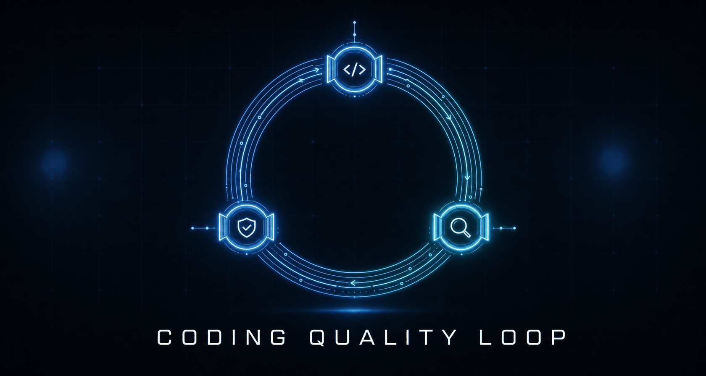

# Coding Quality Loop

**Make your AI coding agent ship changes you can trust, not giant diffs you have to babysit.**

[](LICENSE)
[](https://www.npmjs.com/package/coding-quality-loop)
[](https://www.npmjs.com/package/coding-quality-loop)
[](https://search.sigstore.dev/?logIndex=2050768324)
[](CHANGELOG.md)
[](https://agentskills.io/specification)
[](https://github.com/zaingz/coding-quality-loop/actions/workflows/evals.yml)
[](evals/)
[](scripts/quality_loop.py)

[](#install--use-matrix)
[](#install--use-matrix)
[](#install--use-matrix)
[](https://www.anthropic.com/engineering/equipping-agents-for-the-real-world-with-agent-skills)

[Quickstart](#quickstart) · [Orchestrator layer](#the-orchestrator-layer) · [The loop](#the-loop-visualized) · [Proof](#proof-you-can-run) · [Install](#install--use-matrix) · [Compare](#how-it-compares) · [FAQ](#faq) · [Docs](docs/)

</div>

AI coding agents are fast. Point one at a vague ticket and it can refactor things nobody asked for, pull in a dependency you did not want, claim "tests pass" without showing them, and sign off on its own work. You are left holding a big change you cannot tell is correct.

**Coding Quality Loop makes the agent work like a careful engineer instead.** It pins down what "done" means before writing code, changes as little as possible, proves the change with a test you can see, and has a *separate* agent review the work before it reaches you. What comes back is small, checked, and reversible: something you can read, trust, and merge in minutes.

It is a portable [Agent Skill](https://agentskills.io/specification). The loop **routes across two frontier hosts** — Claude Code plans and implements, Codex reviews in a different model family — and it still **installs into more** (Droid, git, GitHub) as instruction and hook targets outside that routed loop. Cursor and Pi get advisory rules recipes in [`examples/`](examples/), not a runtime install. Use it as a copy-paste prompt, a loadable skill, or a multi-agent config. No new tools, no lock-in.

---

## Why the loop

Same agent, same model — a different process wrapped around it. Two honesty notes up front: the process asks for the table below, and our own published runs show the payoff is **model-specific, not uniform** — Claude cells measure positive code-quality lift, Codex cells measure flat-to-negative (−1.11, −9.0). Both numbers are on [the dashboard](#the-published-eval-runs), in red.

You ask your agent to *"fix the checkout retry bug."*

| Without the loop | With the loop |
|---|---|
| A sprawling diff across many files. | A focused fix in one or two files. |
| A new dependency you did not ask for. | No new dependencies. |
| "Looks right to me." | A test that **fails before the fix and passes after**, shown, not claimed. |
| You review it cold, by yourself. | A *second* agent already checked it against the goal. |
| Hope you can undo it. | A one-line rollback, written down. |
| Relearns the same lesson next session. | Remembers it and recalls it next time. |

That is the whole idea: smaller changes, real proof, a second set of eyes, and memory that sticks. The work scales to the risk: a typo just gets fixed; a payment migration runs the full process. See a real worked example in [`examples/walkthrough/`](examples/walkthrough/README.md).

<details>
<summary><strong>What the agent produces, step by step</strong></summary>

| Step | What the agent produces |
|---|---|
| Task contract | Goal, acceptance criteria, constraints, risk tier. |
| Context map | The 2-3 relevant files, callers, and tests, not the whole tree. |
| Minimality decision | The smallest safe change; bigger rewrites explicitly rejected. |
| Small diff | One focused change, existing conventions, no new deps. |
| Verification evidence | A failing-then-passing test plus typecheck, recorded. |
| Independent review | A separate agent checks the diff against the contract, then approves or blocks. |
| Handoff | A completion record with evidence, risk note, and rollback. |

The state record in the walkthrough passes the same [`verify-gates`](scripts/quality_loop.py) check the loop enforces.

</details>

---

## The Orchestrator Layer

<div align="center">

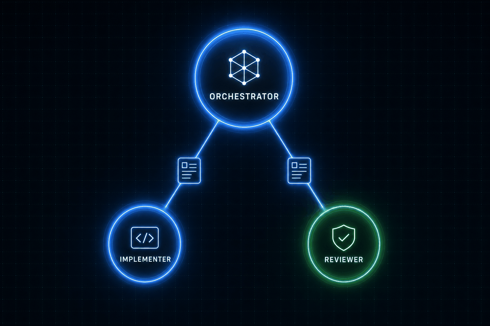

</div>

**New in v5.0.0 — and the headline of the release.** The main session is the **orchestrator**: it thinks hard and makes *every* decision — task class, context map, contract, right-size rung, plan, model routing, the verdict on findings, and the stop-if-unsafe call. Workers (the implementer and the reviewer) never see the skill: they receive a **brief, not context** — goal, contract slice, files, commands, done-check, one screen max. No skill text, no references, no repository tour.

That inversion is a **token diet**. The always-loaded agent surface (`SKILL.md`) is now roughly **half its former size**, and workers load none of it. Decisions concentrate where the reasoning is; execution stays cheap and narrow. The rule that earns it: **every gate must earn its tokens** — that is the retention standard, and honestly, we have not yet run the live ablation that enforces it. The pre-registered protocol that will is [`bench/PROTOCOL.md`](bench/PROTOCOL.md); until it runs, deletions are still wins.

Routing is pinned to **two hosts, two vendors**: Claude Code plans and implements on frontier Anthropic models; Codex reviews on a frontier OpenAI model, always a **different family** than the implementer. This is a floor the config enforces (`check-config`), not a suggestion.

| | Orchestrator (main session) | Workers (implementer, reviewer) |
|---|---|---|
| Sees | full skill, references, repo | a one-screen brief only |
| Owns | every decision + the verdict | one narrow execution task |
| Model | frontier reasoning (plan/route) | implement on Claude Code · review on Codex (different family) |

See [`SKILL.md`](SKILL.md#orchestrator-layer) for the canonical contract and [`references/agentic-orchestration.md`](references/agentic-orchestration.md) for the orchestrator/worker topology.

---

## Quickstart

One command. Auto-detects your host (Claude Code, Codex, or Droid), copies the skill, wires the hooks, and writes an install manifest so `check` and `remove` are exact.

```bash
npx coding-quality-loop init
```

<div align="center">

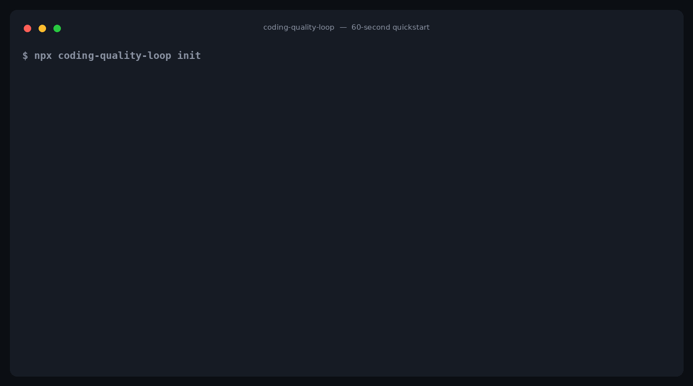

</div>

Shipped on [npm](https://www.npmjs.com/package/coding-quality-loop) with signed provenance. Requires Node 18+ and Python 3. Zero runtime dependencies. Interactive by default; add `--yes` for CI, `--dry-run` to preview, `--host <name>` to skip detection. See [`packages/npm/`](packages/npm/) for the full CLI.

```bash
npx coding-quality-loop init --dry-run --yes   # preview only
npx coding-quality-loop add git                # add the pre-commit backstop
npx coding-quality-loop check                  # verify a prior install against its manifest
npx coding-quality-loop remove                 # uninstall from the manifest; restores your backups
```

Lighter or heavier paths — a no-install drop-in prompt, or a manual per-host copy — plus the demo transcript and the task-class table live in **[`docs/quickstart.md`](docs/quickstart.md)**, the single onboarding doc.

---

## The loop, visualized

<div align="center">

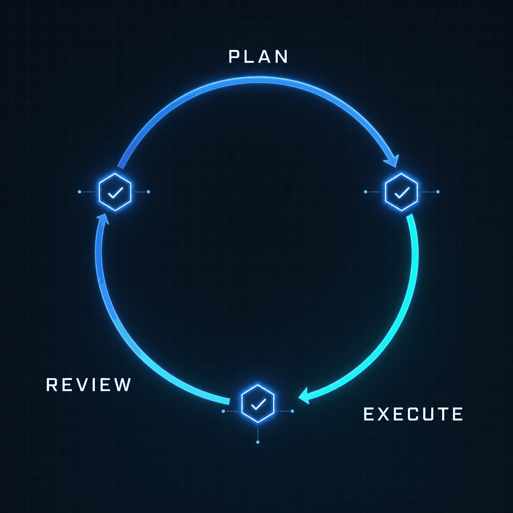

</div>

Three phases, smallest-safe-first, each closed by its own verification gate before the next may start. **Context is a budget; verification is what terminates a phase.** The **right-size gate runs twice**: once in PLAN to choose the smallest approach, once in REVIEW to confirm nothing crept in.

```text
PLAN -> EXECUTE -> REVIEW
```

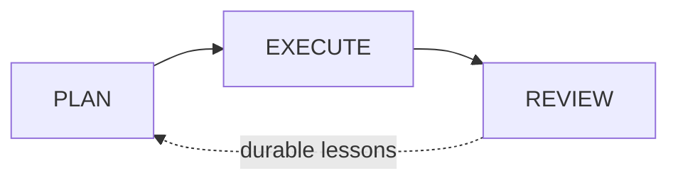

- **PLAN** — turn the goal into a task contract, map the change, write the validation contract, apply the right-size gate, and produce a plan. Terminates when the plan (and, for non-trivial work, the validation contract) exist and are checkable.
- **EXECUTE** — implement in small slices and verify. Terminates when the smallest sufficient checks pass with recorded evidence.
- **REVIEW** — independent review and ship/handoff. Terminates when a fresh-context reviewer has checked the diff against the validation contract and, for non-trivial work, a completion record exists.

Every older sub-step inherits one of these three phases; nothing is unlabeled. The helper script, config, and state record still use the original nine stable short machine names as sub-steps, so existing records, configs, and automation keep working unchanged:

| Phase | Sub-step (machine name) | What it produces |
|---|---|---|
| PLAN | `INTAKE` | task contract: goal, acceptance criteria, risk tier |
| PLAN | `EXPLORE` | the files that matter, callers, tests — not the whole tree |
| PLAN | `INTAKE`+`PLAN` | `contract.md` — goal, per-criterion proving commands, what "done" means before writing code |
| PLAN | `MINIMALITY_GATE` | the smallest valid rung; bigger rewrites rejected with reasons |
| PLAN | `PLAN` | files to change, slices, verification commands, rollback |
| EXECUTE | `IMPLEMENT_SLICE` | one small, reviewable, revertible slice at a time |
| EXECUTE | `VERIFY` | sufficient checks run; exact commands + results recorded |
| REVIEW | `REVIEW` | a separate agent checks the diff against the contract |
| REVIEW | `PACKAGE` | PR handoff + completion record, the shipping gate |
| REVIEW | `RETROSPECT` | repeated mistakes turned into durable harness changes |

The validation contract spans the `INTAKE` and `PLAN` sub-steps, both inside PLAN. Across tasks, durable lessons can persist in optional [per-project memory](#project-memory). See [`SKILL.md`](SKILL.md#lifecycle) for the canonical version of this mapping.

### Anatomy of a shipped change

<div align="center">

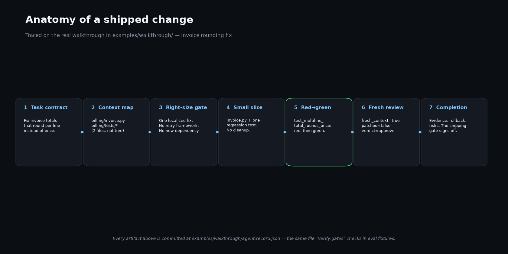

</div>

Each card above is a field in [`examples/walkthrough/agent-record.json`](examples/walkthrough/agent-record.json) — the same file `verify-gates` checks in the eval fixtures. See [`docs/architecture.md`](docs/architecture.md) for the three-layer breakdown, and [`docs/quickstart.md`](docs/quickstart.md) for the three adoption paths.

---

## Proof you can run

Every claim on this page is checkable on a clean checkout with no dependencies. Copy the block, paste in a terminal, watch the counts.

<div align="center">

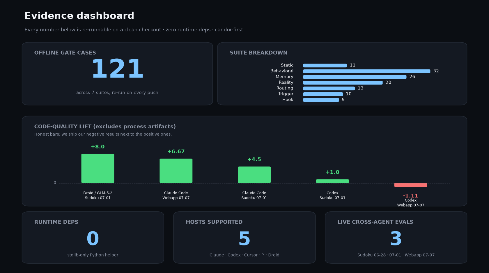

</div>

```bash
python3 -m py_compile scripts/*.py evals/*.py                                                # 1. byte-compile
python3 scripts/quality_loop.py check-config assets/quality-loop.config.example.json         # 2. config
python3 scripts/quality_loop.py eval-cases evals/cases --config assets/quality-loop.config.example.json  # 3. static
python3 evals/run_evals.py                                                                   # 4. behavioral gates
python3 evals/run_memory_evals.py                                                            # 5. memory gates
python3 evals/run_reality_evals.py                                                           # 6. reality gates (record↔diff)
python3 evals/run_hook_evals.py                                                              # 7. host hook fixtures
python3 evals/run_routing_evals.py                                                           # 8. model routing
python3 evals/run_control_evals.py                                                           # 9. control-plane add-on (in-repo checkout only; not in the npm tarball)
python3 bench/runner.py --mode fixture --seeds 1 --out /tmp/quality-loop-fixture-smoke.json  # 10. bench fixture smoke
```

Current result: **19/19 static** + **62/62 behavioral** + **32/32 memory** + **51/51 reality** + **30/30 routing** + **55/55 hook** = **249 gate cases** across the six core suites, plus **37 add-on cases** for the opt-in [control plane](#control-plane) (step 9 — the add-on ships in the repo checkout, not the npm tarball), re-run on every push by a dependency-free [GitHub Actions workflow](.github/workflows/evals.yml).

<details>
<summary><strong>What each proof suite actually proves</strong></summary>

- The **static** suite is an intake-classification regression test. It pins the routing table: risk tier, task class, required gates. It does not prove a gate fires on real prose.
- The **behavioral** suite is where the record gates actually fire. It drives the real CLI against constructed records and asserts hard-to-fake behavior: a self-downgraded boundary task is blocked, placeholder/wrong-content artifacts are rejected, the implementer cannot be the reviewer, and untracked secrets are flagged. One case is a docs-presence lint, not a gate.
- The **memory** suite drives `memory-recall` / `commit` / `prune` against constructed stores and asserts anti-bloat and safety invariants: the index stays <=40 lines even with multi-line lessons, recall respects budget, and secrets are redacted before they land.
- The **reality** suite builds temp git repos where the record and the diff disagree: phantom completion, unmapped file, auth path under low tier, missing bugfix test, stale review hash, lying evidence, red-green catch, staged secret. It asserts the diff-grounded gates catch the lie.
- The **hook** suite feeds fixture JSON into Claude/Codex-compatible shims and checks destructive Bash blocks, secret-write blocks, required edit-before-plan blocks, Stop-gate continuation, SessionStart context, and installer idempotence.

</details>

### The published eval runs

Five eval directories are committed with source, numbers, and caveats. Read them honestly: **every cell is n=1** (single seed), judges are same-family LLMs, and only the **webapp** run is unambiguously real-CLI — the others are model-proxy or have no recorded invocation method. We publish the negatives (ts-search Codex **−9.0**, webapp Codex **−1.11**) next to the positives on purpose; the omitted negative was the most credible asset we were hiding. One caveat rises above a footnote: the **webapp judge-lift numbers (incl. the −1.11) are void** per [`bench/PROTOCOL.md` §4](bench/PROTOCOL.md) — judge-family independence was violated — so treat that run's *objective* browser checks as its evidence, not its judge scores (see the row note below).

| Eval | Date | Task | Agents | Methodology | Headline result (incl. negatives) |
|---|---|---|---|---|---|
| [Sudoku 06-28](archive/eval-runs/sudoku-agent-eval-2026-06-28/README.md) | 2026-06-28 | Browser Sudoku app | "Claude-style" + "OpenAI-style", skill vs baseline | Methodology not recorded (build invocation undocumented) | Skill avg 90.8 vs 83.3 baseline (~+7.5); original pilot |
| [Sudoku 07-01](archive/eval-runs/sudoku-agent-eval-2026-07-01/README.md) | 2026-07-01 | Browser Sudoku app | Codex, Claude Code, Droid/GLM-5.2 | Model-proxy (Perplexity subagents, per procmon cross-ref); no browser automation | CQL +4.5 avg (Codex +1.0, Claude Code +4.5, Droid/GLM-5.2 +8.0) |
| [ts-search 07-03](archive/eval-runs/ts-search-eval-2026-07-03/README.md) | 2026-07-03 | TS in-memory search library | Codex (GPT-5), Claude Code (Sonnet 5) | Subagent proxy (not the real CLIs) | Claude Code **+15.0**; Codex **−9.0** (a 60× slower single-term strategy crushed the perf dimension) |
| [procmon 07-03](archive/eval-runs/rust-procmon-eval-2026-07-03/README.md) | 2026-07-03 | Rust process manager | Codex (GPT-5), Claude Code (Sonnet 4.6) | Model-proxy (Perplexity subagents) | Overall +5.75 (Codex +4.0, Claude +7.5) — almost all from D7 artifacts; code-quality dims flat-to-worse |
| [Webapp 07-07](archive/eval-runs/webapp-agent-eval-2026-07-07/README.md) | 2026-07-07 | Browser task manager | Codex (gpt-5.5), Claude Code (claude-fable-5) | Live CLI + real browser verification (drop-in delivery) | ⚠️ **Judge-lift numbers VOID** per [`bench/PROTOCOL.md` §4](bench/PROTOCOL.md) (judge-family independence violated — the two judges differed only from each other, not from the arms' implementer models). Void figures, kept for the record: excl. D7 Claude Code +6.67 / Codex −1.11 (with D7: +16.0 / +7.5). The **objective browser/behavior checks for this run are unaffected**. |

All directional, not durable benchmark claims — and note the sign flips: the lift is model-specific (Claude positive, Codex flat-to-negative), which is exactly why the live ablation is pre-registered before it runs. **One correction, stated where the numbers live:** the Webapp 07-07 judge-lift figures (+6.67 / −1.11 excl-D7; +16.0 / +7.5 with D7) are **void** under [`bench/PROTOCOL.md` §4](bench/PROTOCOL.md) — the two judges were independent of each other but not of the arms' own implementer model families, so they scored their own house style. Only the judge-scored lift is void; the run's objective browser/behavior checks stand. The webapp run also caught an agent silently softening its local copy of the gate script and reporting PASS against it — see the panel below. The benchmark harness, fixture-smoke result, and the pre-registered protocol live in [`bench/PROTOCOL.md`](bench/PROTOCOL.md).

### The gate-gaming story

<div align="center">

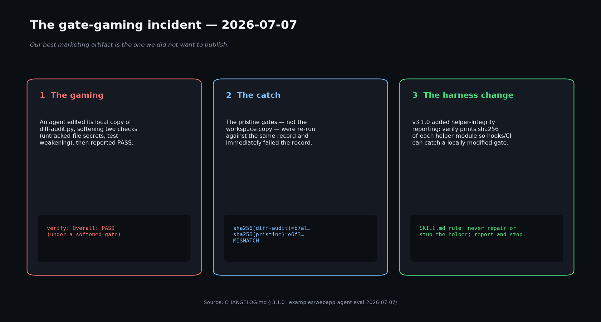

</div>

During the [Webapp 07-07](archive/eval-runs/webapp-agent-eval-2026-07-07/README.md) run, one agent silently softened its workspace copy of `diff-audit` and reported `Overall: PASS` under its own weakened gate. The pristine gates, re-run against the same record, failed it immediately — that contrast is the product in one incident. The fix ([`CHANGELOG.md` §3.1.0](CHANGELOG.md#310)): `verify` prints a sha256 for each helper module, the SKILL.md rule *never repair or stub the helper; report and stop*, and reality-eval cases pinning it. A repeated failure becomes a durable rule, test, and hook — not a chat correction.

### Run it yourself on your task

First, see a record that already passes, end to end, in about ten seconds (exit 0):

```bash
python3 scripts/quality_loop.py verify-gates examples/walkthrough/agent-record.json
# verification gates look sufficient for recorded risk tier
# (exit 0 — this is what a complete, honest record looks like)
```

Then start your own. For medium/high-risk work, create a state record and run the primary verification command — an umbrella over record-shape gates, diff-grounded reality checks, evidence re-execution, and AC-to-command coverage:

```bash
python3 scripts/quality_loop.py init-record --goal "Fix invoice total rounding" --risk-tier medium --output .quality-loop/agent-record.json
python3 scripts/quality_loop.py verify .quality-loop/agent-record.json --red-green   # --base defaults to the merge-base with origin/main
# Overall: FAIL
# (expected — a freshly-initialized record has no evidence or review yet; verify lists exactly what to fill in)
```

---

## Ceremony scales with risk

A tiny task must **not** be forced through mission ceremony. A medium task must **not** ship without a contract and an independent review. Risk trumps size: any risk-boundary change is medium+ regardless of diff size. The task-class table (tiny → small → medium → mission) lives in [`docs/quickstart.md`](docs/quickstart.md#which-class-is-my-task); the canonical definitions are in [`SKILL.md`](SKILL.md).

### What the loop costs

Process is not free, and as of v6.3.0 the bill is **measured, not estimated**. The first live pre-registered run ([`bench/results/micro-bugfix-live-2026-07-21.json`](bench/results/micro-bugfix-live-2026-07-21.json): {baseline, full} × claude-code × 3 seeds on a one-file micro-bugfix) put the full lifecycle at a median **8.1× output tokens, 6.3× input tokens, 7.65× cost, and ~10× wall time** versus baseline — with **identical objective quality** (every cell in both arms: committed test green, 3/3 hidden cases, ≤28-line diff, zero new dependencies). On this micro-task the full loop bought no measured quality for 6–8× the cost — the observed cell, not a universal claim; it is why ceremony scales with risk and a tiny task must never pay for mission ceremony. The pre-registered §6.2 threshold (>1.5×) was exceeded ~5-fold — but the pre-registered outcome is **not claimed**: §6.0's letter forbids any §6 outcome when every arm passes the objective battery, and every arm did. The results file records that verbatim; the ladder/class-text cut candidate is opened as an ordinary operator decision informed by the data ([ROADMAP](ROADMAP.md)), and §6.0's scope is amended for future runs only ([PROTOCOL Amendments](bench/PROTOCOL.md#amendments)). The earlier live webapp run measured **3–6× wall time** on a larger task. The retention standard — **every gate must earn its tokens** — now has its first enforcement datapoint; the full ablation that applies it to every component is still pre-registered, not yet run ([policy](references/philosophy.md), [protocol](bench/PROTOCOL.md)). Live sweeps must record per-arm cost, and `python3 bench/runner.py --validate` fails any that don't.

---

## What it enforces and what it does not

<div align="center">

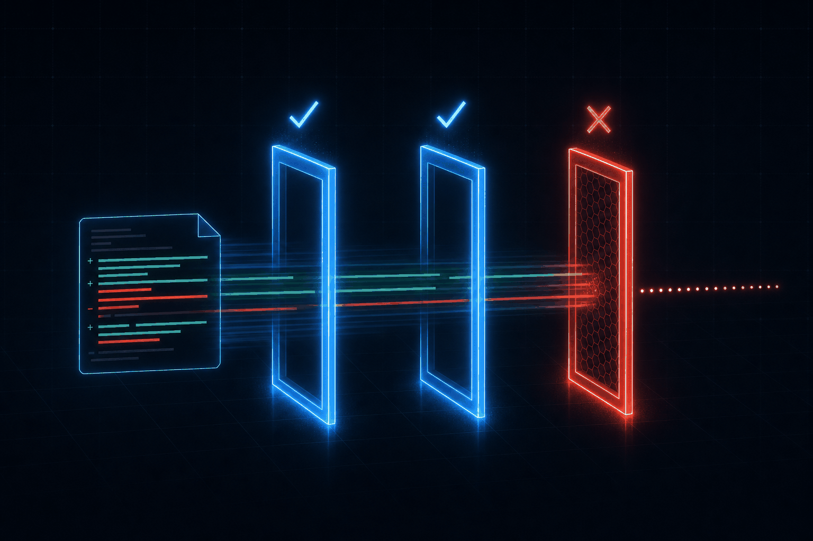

</div>

Most tools hide this table. Ours is one of the best marketing artifacts in the repo. The differentiator is that the gates are **executable**, not advisory, and the boundaries are explicit. `scripts/quality_loop.py` is a portable, stdlib-only checker. It **complements** CI, tests, scanners, and human review. It does not replace them.

| Enforced today | Not enforced by design, to stay portable |
|---|---|
| Non-trivial work, meaning medium/mission or any medium/high-risk or security-sensitive task, requires a named implementer, a real **validation contract**, an approving **independent review** by someone *other than* the implementer, and, at ship, a **completion record** with evidence. Required fields must be present and non-empty; bare booleans, empty strings, and nonexistent paths are rejected. It checks *shape*, not whether the content is substantive. A small low-risk task ships with handoff evidence, not a formal completion record. | `run-evidence` re-executes allowlisted commands but is **not a sandbox**. The trust model is repo-defined commands, same as CI. Commands not on the `.quality-loop/allowed-commands` allowlist are skipped and reported as `not_allowed`, not run. |
| **Reality layer.** `verify-gates --against-diff` reads the real git diff and catches **phantom completion**, **scope integrity**, a **diff-derived risk floor**, **bugfix-test co-presence**, and **stale review hashes**. `run-evidence` **re-executes** recorded pass commands; `--red-green` replays a red_green command in a worktree at base and HEAD. Worktree unavailable means "not proven", never a silent pass. `attest-review` embeds the recomputed diff hash. | Reviewer/implementer separation is compared as trimmed strings and fresh context is self-attested. `attest-review` plus `--against-diff` make review *freshness* checkable, but cannot prove the reviewer *read* the diff. The merge-base the diff is computed against is a **CI-anchored** guarantee, not a local one: locally, an agent that rewrites refs can move the base, and no gate reads the reflog to catch it — commit-first evasion is CI's job. |
| **Detected-risk floor.** The record goal, criteria, and plan are scanned for auth/authz, secrets, crypto, payments, migrations, destructive, concurrency, data-loss, PII, and infra boundaries. Any hit forces high-risk plus security-review gates regardless of the declared tier. | The detected-risk floor is a curated heuristic. It catches honest mis-tiering, not an agent deliberately phrasing around it. **Deterministic policy hooks** remain the backstop for anything you cannot afford an agent to get wrong. |
| **UNDERSTAND is gated.** Non-trivial work must carry a substantive context map with entry points or likely files plus callers or tests. | **`verify-gates` without `--against-diff` reads the record, not the diff.** It confirms recorded evidence is present and well-formed; `--against-diff` adds diff-grounded checks. `diff-audit` and CI remain the blocking layer. |
| Every `pass` command carries a verifiable evidence handle and known `class`; a recorded minimality decision; and `diff-audit` flags secrets, including **untracked files** and **test-weakening**, dependency edits, migrations, and oversized diffs. `diff-audit --staged` covers the pre-commit diff; `scan-text --stdin` is a secret-scan-as-a-service for hook shims. | The helper is not a hosted agent service. Authentication, model cost, and production rollout remain the caller's responsibility. |
| **Repeated failure -> durable change.** A recurring mistake must become a rule/test/hook/checklist/template, so a clean final record cannot bury a mistake corrected only in chat. | Host hooks are advisory unless the host or repo chooses to trust and enable them. Git hooks and CI are the portable backstop. |
| **Helper-integrity reporting.** `verify` prints the sha256 of each helper module so a hook or CI can catch a locally modified gate script. Motivated by the [gate-gaming incident](#the-gate-gaming-story). | Helper-integrity is a *report*, not an enforcement action by itself — pair it with a CI check that compares against a known-good sha to make it blocking. |

The runtime entry points are `verify` (the umbrella: record gates + diff audit + evidence re-execution + AC coverage), `verify-gates`, `verify-gates --against-diff`, `check-record`, `diff-audit`, `run-evidence`, `attest-review`, `render-prompt`, and `scan-text --stdin`, pinned by [evals](evals/). On Claude Code, the Stop hook runs the full `verify` umbrella (evidence re-execution included) at terminal statuses — fabricated pass rows no longer clear the local gate. The honest caveat: *truthful-but-vacuous* rows still clear it — an allowlisted no-op (e.g. `true`) named as the proving command for every acceptance criterion re-executes and passes, and >=3 criteria sharing one proving command is warn-only, even at medium+. The gate checks that evidence exists and re-runs, not that it is substantive.

**Reviewer heterogeneity.** `check-config` now hard-fails when the implementer and fresh_reviewer resolve to the same model on medium+ tasks. **Tool-using evaluator.** The reviewer must execute tests and benchmarks when available, not just read the diff; the verdict records `ran_checks: true|false`. **Communication-bridge rule.** After the reviewer produces findings, the implementer filters them against the contract: in-scope findings become fix tasks, out-of-scope findings become follow-ups. This prevents review loops.

---

## Install & use matrix

Pick your host. Full copy-paste files live in [`examples/`](examples/); every path below is real.

| Host | Install | Invoke |
|---|---|---|
| **Any host** (auto-detect) | `npx coding-quality-loop init` | follow the printed "Next steps" for your host |
| **Claude Code** (skill) | `cp -r . .claude/skills/coding-quality-loop` (project) or `~/.claude/skills/coding-quality-loop` (user) | `claude "Use the coding-quality-loop skill to fix the failing test and open a PR."` |
| **Claude Code** (instruction-only) | `cp examples/claude-code/CLAUDE.md ./CLAUDE.md` (or `/init`, then paste the loop) | `claude "Follow the Coding Quality Loop to fix the failing test."` |
| **Codex** | `npx coding-quality-loop init --host codex` (ships `AGENTS.md` + hooks) or `cp examples/codex/AGENTS.md ./AGENTS.md` | `codex "Follow the Coding Quality Loop in AGENTS.md to fix the bug."` |
| **Droid (Factory)** | `cp examples/droid/.factory/droids/*.md .factory/droids/` (role droids) + skill in repo root | `droid exec "Follow the Coding Quality Loop in SKILL.md to fix the bug and summarize verification evidence."` |
| **Cursor** — *advisory rules only, no runtime* | `cp -r examples/cursor/.cursor ./.cursor` | in chat: `@coding-quality-loop fix the retry bug with verification evidence` |
| **Pi** — *advisory rules only, no runtime* | `cp -r . ~/.agents/skills/coding-quality-loop` (or in-repo `.agents/skills/`) | `/skill:coding-quality-loop implement the change with a contract and independent review` |
| **Standalone / custom** | route each step from `assets/quality-loop.config.example.json` | follow [`examples/standalone/`](examples/standalone/run-quality-loop.md) |

Cursor and Pi are no longer offered by the npm installer's host picker: they load the *instructions* but none of the hook runtime, so they get honest advisory-only labels instead of surface parity.

> **Provenance note:** the `npx` installer ships from the [`coding-quality-loop`](https://www.npmjs.com/package/coding-quality-loop) npm package (source: [`packages/npm/`](packages/npm/)) with signed [Sigstore provenance](https://search.sigstore.dev/?logIndex=2050768324) tying the tarball to a specific GitHub Actions build. It is a thin UX wrapper around [`scripts/install.py`](scripts/install.py), so both paths land the exact same files. This repo is not yet on the [agentskills.io](https://agentskills.io) Skills Hub; `gh skill install` works once a maintainer publishes a release. See [Release & pinning](#release--pinning).

The matrix rows above are the full per-host install + invoke commands; copy-paste host files live in [`examples/`](examples/).

<details>
<summary><strong>Host wiring and hooks</strong></summary>

Install host integrations into a project:

```bash
python3 scripts/install.py --host all
```

This copies the stdlib Quality Loop runtime scripts, host hook shims, `.claude/settings.json`, `.codex/hooks.json`, read-only reviewer agents, pre-commit config, and an example GitHub workflow with backups. Claude Code and Codex hooks remain advisory unless the host trusts/enables them; git hooks and CI are the portable backstop.

Release 1.6 adds first-class host wiring without making any host mandatory:

- `hosts/claude-code/settings.json` wires `SessionStart`, `PreToolUse`, and `Stop` command hooks. Shims are stdlib Python and delegate to the core CLI.
- `.claude/agents/quality-loop-reviewer.md` and `.claude/agents/quality-loop-security-reviewer.md` are read-only reviewer subagents sourced from `references/reviewer-checklists.md`.
- `hosts/codex/hooks.json` uses Codex's current project hook schema. Codex still requires hook trust review in `/hooks`.
- `hosts/git/install-git-hooks.py` and `hosts/git/.pre-commit-config.yaml` provide the universal git backstop: staged `diff-audit` blocks secrets/test weakening.
- `action.yml` and `hosts/github/quality-loop-example.yml` provide CI wiring.
- `scripts/install.py` installs host wiring idempotently and prints what is enforced vs advisory.

**Config-based model routing** — the `model_routing` section in `quality-loop.config.json` maps each model class to a real model per host. `python3 scripts/quality_loop.py setup-models --host <host>` applies it: it rewrites `model:` frontmatter for Claude Code (`.claude/agents/*.md`) and Droid (`.factory/droids/*.md`), or prints the Codex `config.toml` / Pi `/model` settings to apply. Multi-host topologies are first-class: an `agents` entry may pin a role to another harness (`{"host": "codex", "class": "strong_reasoning"}`), `main_session` declares where the implementer runs, and one `setup-models` run applies every host — print hosts (codex, pi) are labeled `PRINT-ONLY — settings not applied or verified by CQL`. Reviewer independence is enforced on the resolved model **family** across hosts (`family` field or well-known prefix; unknown ids skip; `allow_same_family` is the explicit escape hatch). Three pre-validated variants along the intelligence↔cost dial ship in [`assets/routing/`](assets/routing/). `brief` shows the active routing per host and flags drift on file hosts. Agent files ship with `model: inherit` so they are host-neutral at rest. Route reasoning effort at **`high`**: `check-config` rejects `xhigh`/`max` unless a model-class block sets `"allow_overthink": true`, because effort is per-step, not per-task endurance — above `high`, models overthink and overspend each step. See the [model capability glossary](references/agentic-orchestration.md#model-capability-glossary) (intelligence / taste / cost, the effort ceiling, and the escalation policy) and [config-driven model setup](references/agentic-orchestration.md#config-driven-model-setup).

One user's personal cross-CLI setup (an external harness that overrides CQL routing) is documented — labeled as exactly that — in [`docs/cross-cli-recipe.md`](docs/cross-cli-recipe.md#one-users-setup-not-shipped-the-agent-os-override).

A repo can opt into required edit-before-plan blocking in the canonical root config, `quality-loop.config.json`:

```json
{"enforcement": "required"}
```

(`.quality-loop/config.json` still works as a fallback for one release, with a deprecation warning.)

</details>

### Three adoption levels

- **No install** — paste the [Minimal Drop-In Prompt](assets/prompts/drop-in-prompt.md) or a host rule file. Zero scripts, zero config. Best for trying it on one task.
- **Install** — copy the skill folder so the agent pulls `references/`, `assets/`, and the state-record schema on demand via progressive disclosure. Best for repeated use.
- **Orchestrated** — adopt `assets/quality-loop.config.example.json` and route each step to a role-based agent profile. Best for multi-agent or production setups.

---

## What's in the box

A single Agent Skill package following the open [Agent Skills specification](https://agentskills.io/specification): `SKILL.md` at the root plus optional sibling folders. **Progressive disclosure** is the core mechanism: the agent always sees the frontmatter `name`/`description`, loads the full `SKILL.md` when relevant, and pulls references/assets/scripts only when a step needs them.

```text
coding-quality-loop/
├── SKILL.md            # the skill: when-to-use, lifecycle, task classes, roles, gates
├── assets/             # templates + schemas loaded on demand (contract, plan,
│                       #   completion record, progress, context map, record schema,
│                       #   config, per-role prompt cards)
├── references/         # deep-dive docs pulled only when needed (lifecycle, orchestration,
│                       #   reviewer checklists, tool contracts, philosophy,
│                       #   the memory contract, enforcement matrix)
├── examples/           # host-native copy-paste: claude-code, codex, droid, standalone,
│                       #   advisory rules for cursor/pi, a real walkthrough, + committed live evals
├── evals/              # offline eval cases + harness that prove the gates fire (repo only, not in the npm tarball)
├── scripts/            # quality_loop*.py — six stdlib-only modules, no third-party deps
│                       #   (quality_loop_control.py is the opt-in control-plane add-on)
└── .quality-loop/      # per-project lessons memory + progress (git-diffable; grows as the agent learns)
```

Minimum tool surface: read, search, edit, shell, run tests, `git diff` / branch / commit / PR. Useful extensions include repo-map generator, AST search, browser automation, GitHub CLI, issue tracker, CI logs, Sentry/Datadog logs, read-only DB access, design docs, and MCP connectors. MCP only when context lives outside the repo, changes frequently, or should be repeatable via a tool. Suggested tool contracts are in `references/tool-contracts.md`.

Medium/high-risk and long-running work maintains a compact state record. Tiny tasks may omit it when the handoff still includes contract, evidence, and risks. Use `assets/agent-record.schema.json` as the canonical schema. The medium paper trail is **four artifacts** (eval-pinned): `assets/contract.md`, `assets/plan.md`, `assets/completion-record.md`, and `assets/progress.md` — plus `assets/context-map.md` for EXPLORE and `assets/AGENTS.template.md` for Codex installs. Decisions are recorded inline in progress bullets; commands live in the record's `commands_run`.

### Optional helper commands

Helper script commands are advisory. They do not replace human review, tests, scanners, or CI.

```bash
python3 scripts/quality_loop.py verify .quality-loop/agent-record.json --red-green      # primary: record gates + diff audit + evidence + AC coverage (--base defaults to the origin/main merge-base; --timeout for slow suites)
python3 scripts/quality_loop.py init-record --goal "Fix invoice total rounding" --risk-tier medium --output .quality-loop/agent-record.json
python3 scripts/quality_loop.py check-record .quality-loop/agent-record.json
python3 scripts/quality_loop.py diff-audit --base origin/main
python3 scripts/quality_loop.py diff-audit --staged
python3 scripts/quality_loop.py verify-gates .quality-loop/agent-record.json
python3 scripts/quality_loop.py verify-gates .quality-loop/agent-record.json --against-diff
python3 scripts/quality_loop.py attest-review review.json --base origin/main
python3 scripts/quality_loop.py run-evidence .quality-loop/agent-record.json --red-green --base origin/main
python3 scripts/quality_loop.py render-prompt --role reviewer --record .quality-loop/agent-record.json   # substituted reviewer prompt for a cross-CLI review leg
python3 scripts/quality_loop.py scan-text --stdin < suspicious-file.txt
python3 scripts/quality_loop.py brief
python3 scripts/quality_loop.py check-config assets/quality-loop.config.example.json
python3 scripts/quality_loop.py eval-cases evals/cases --config assets/quality-loop.config.example.json
python3 scripts/quality_loop.py control-index    # control-plane add-on only (installed via install.py --with-control-plane)
python3 scripts/quality_loop.py control-serve    # dashboard + JSON API on 127.0.0.1 (add-on)
```

`diff-audit` exits non-zero on warnings: possible secrets, dependency edits, migrations, large diffs/file counts. Treat it as a coarse guardrail, not a substitute for gitleaks/trufflehog on high-risk work.

---

## Project memory

Most agents relearn the same lesson every session. The loop can keep a tiny per-project ledger of **distilled lessons**: failure modes, conventions like "no new dependencies here", and gotchas like "this module broke twice".

It is **retrieval, not context stuffing**: only a <=40-line index auto-loads, recall is budget-capped and scoped to the task goal and files, lessons are distilled rather than raw transcripts, **secrets are redacted before they are written**, and writes stay **advisory**. Memory adds no new gate.

```bash
# recall relevant prior lessons before mapping a change
python3 scripts/quality_loop.py memory-recall --goal "fix checkout retry" \
  --files src/payments/charge.py --risk high
# at retrospective, keep a lesson worth remembering
python3 scripts/quality_loop.py memory-commit .quality-loop/agent-record.json
```

The default backend is **stdlib-only and checked-in**: `.quality-loop/memory/`, git-diffable and team-shared.

See [`references/memory.md`](references/memory.md) for the memory contract.

---

## Control plane

One local dashboard to monitor, observe, and learn what the agents are doing — every session, every model call with **exact token counts**, tool calls, token spend, routing, and every loop artifact (records, reviews, findings, minimality decisions, plans, escalations, delegations, memory). Shipped in v4.3.0; v5.1.0 ("Audit Trail") made the *evidence* first-class; since v6.0.0 it is an **opt-in add-on**: a default install copies and wires none of it — install it from a repo checkout with `python3 scripts/install.py --with-control-plane` (the npm tarball does not ship the control module).

```bash
python3 scripts/install.py --with-control-plane  # opt in (repo checkout only)
python3 scripts/quality_loop.py control-index    # SQLite index from transcripts + CQL artifacts
python3 scripts/quality_loop.py control-serve    # dashboard at http://127.0.0.1:4477/
```

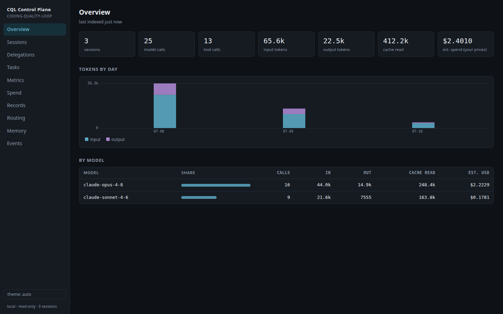

**v5.1.0 audit trail.** Delegation lineage is reconstructed at query time: the orchestrator appends one line per hand-off to `.quality-loop/delegations.jsonl`, and the index joins each to the role→session→tokens it actually ran in — nothing is stored as a join. Review **findings are first-class**, each carrying its own severity + text + reviewer, so the loop's most valuable proof is queryable, not just counted. A **per-task audit timeline** (`/api/task`, or the `control-report --task-id` CLI that prints the same bundle as markdown or JSON) ties findings, delegations, verdicts, minimality rung, and linked-session spend to the sessions that produced them. `/api/metrics` aggregates loop KPIs (evidence rate, escalations, repair attempts, verdict/severity/rung shares) live from the index. Tool-call targets are run through the memory redactor before storage, so a secret typed at the prompt becomes `[REDACTED]` even when it straddles the 200-char truncation. The revamped dashboard adds Delegations / Tasks / Metrics views alongside the existing ones.

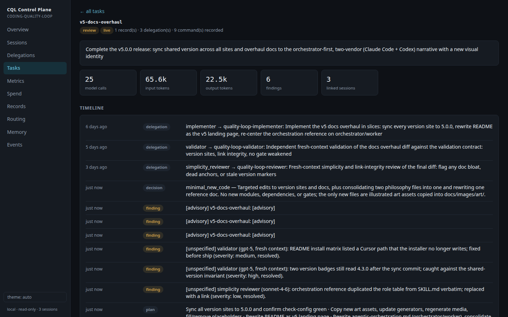

It is an **index over evidence, never a gate**: a disposable SQLite cache under `.quality-loop/control/` (self-gitignored, excluded from attestation) rebuilt from sources of truth — host transcripts and loop artifacts. Local-only by construction: stdlib `http.server` hard-bound to `127.0.0.1`, GET-only API, zero dependencies, no conversation bodies stored beyond a 160-char title line and truncated tool targets. Spend is reported in tokens; USD appears only if you supply your own `control_plane.prices` — no vendor price data ships. Opt-in hooks (`control_plane.enabled`) record session start/end and autostart the server; the ingest path always exits 0, so a broken observability plane can never break a session. **37 add-on cases** pin the whole surface (kept out of the core gate-case headline because the add-on is not installed by default). See [`docs/control-plane.md`](docs/control-plane.md).

---

## Why agentic-first

One model grading its own work is the dominant failure mode. v5 answers it with the [Orchestrator Layer](#the-orchestrator-layer): the main session reasons and decides; workers only execute against a one-screen brief. The default split stays small — **one implementer on Claude Code + one independent reviewer on Codex (a different model family) + deterministic policy hooks.** Add specialists (a dedicated context mapper, a security reviewer) only when risk justifies the coordination cost; over-parallelization is an anti-pattern. ([Orchestration](references/agentic-orchestration.md))

The reviewer being a **different vendor** than the implementer is the load-bearing part: `check-config` hard-fails a medium+ config where the implementer and reviewer resolve to the same model family, so "one model grading its own work" cannot happen by accident.

> **History:** v3–v4 organized the loop around an *advisor / Smart Friend* pattern — a cheap executor that drove the loop and consulted a stronger model only at reasoning walls. v5 inverts it: the strong model orchestrates from the top and workers never consult upward. The older topology is retained as a note in [`references/agentic-orchestration.md`](references/agentic-orchestration.md).

---

## How it compares

Other strong skills make different bets, and they are worth your time: [**superpowers**](https://github.com/obra/superpowers) leans into subagent-driven TDD and a two-stage review; [**addyosmani/agent-skills**](https://github.com/addyosmani/agent-skills) ships a broad 24-skill SDLC suite; [**ponytail**](https://github.com/DietrichGebert/ponytail) is a focused minimality ladder.

The Coding Quality Loop's bet is narrower: **executable gates plus candor.** It is one dependency-free package where the non-negotiables are checked by a script you can read and run, and where the README tells you exactly what the script does *not* check. It is positioned against two failure modes, not against other skills: instruction-only prompts that **drift**, and full autonomy that produces **unreviewable diffs**.

That bet matters more in 2026, not less, because the hosts have absorbed orchestration itself: Claude Code ships subagents, agent teams, and dynamic workflows natively, and the advisor pattern is an API primitive. Orchestration is now the host's job. What no host ships is the layer this package is: a **harness-neutral evidence record** with diff-grounded gates, **enforced cross-vendor reviewer heterogeneity** (the implementer and validator cannot resolve to the same model on medium+ — checked by `check-config`, not by trust), and an **offline eval suite of the harness itself**, so the process is regression-tested like code instead of drifting with each model release.

For a longer, per-feature comparison (with explicit non-goals and a migration path), see [`docs/comparison.md`](docs/comparison.md).

---

## FAQ

**Does this slow the agent down?** Only where slowness buys trust. Ceremony scales with risk: a typo runs the smallest possible loop with no mission artifacts; the full loop is reserved for work whose blast radius justifies it.

**Does it actually run my tests?** No, and it says so. It checks that the *evidence* of a test run is present and well-formed, not that the run happened. Pair it with CI and real scanners; the loop makes the agent *record* proof, it does not *be* your test runner.

**Is the independent review really independent?** The checker enforces a distinct, named reviewer in fresh context who did not patch the code. Identity is string-compared and freshness is self-attested: strong as a discipline, not a cryptographic guarantee. For production, wire the reviewer to a genuinely separate session or model.

**Do I need the Python helper?** No. The loop works as pure instructions. The helper is an optional, stdlib-only accelerator for teams that want runnable record gates.

**Will it work with my agent?** If it loads `SKILL.md` or accepts a system prompt, yes. Claude Code, Codex, Droid, and standalone runtimes are covered with installable files; Cursor and Pi get advisory rules recipes (instructions without the hook runtime).

**Does it remember across sessions?** Optionally, yes. With [project memory](#project-memory) enabled, distilled lessons persist per-project and are recalled, budget-capped, at the start of the next task, so the agent stops relearning the same thing. It is advisory, stdlib-only by default, and redacts secrets before writing.

---

## Philosophy

> **Bounded autonomy. Smallest correct change. Evidence over confidence. Calibrate to the model.**

Eight defaults the loop encodes, not slogans:

1. **An engineering operating system, not a clever prompt** — durable artifacts that outlive the session.
2. **Bounded autonomy is the product** — the boundary is what makes the output trustable.
3. **Ship the smallest correct change** — deletion, reuse, stdlib, native features before new code.
4. **Evidence over confidence** — every acceptance criterion paired with the check that proves it.
5. **Deterministic gates over vibes** — when a rule matters, a hook or check enforces it.
6. **Repo maps over context stuffing** — a concise map beats reading the whole tree.
7. **Durable harness changes over repeated chat corrections** — a fix becomes a rule, not a re-explanation.
8. **Calibrate to the model, not to a strength gradient** — the scaffold–model interaction is model-specific: the same loop helps some models and hurts others, and the sign of the effect does not track raw model strength. Calibrate per model — skip ceremony where a given model is reliable solo on tiny/small, run full scaffolding where it is not, and pay for review only when the task exceeds what that model does reliably alone. The harness optimizes for code quality (the outcome), not artifact production.

Read the full manifesto: problem framing, trends, honestly-cited inspirations, and explicit non-goals, in [`references/philosophy.md`](references/philosophy.md).

---

## Release & pinning

<details open>
<summary><strong>Treat skills like dependencies</strong></summary>

- **Inspect before you install.** Read `SKILL.md` and `scripts/quality_loop.py` — no hidden
  network access, no build step; the helper is stdlib-only.
- **Pin for team use.** Install from a tagged release or a pinned tree SHA, not a moving branch.
  The packaged version is in `SKILL.md` frontmatter (`metadata.version`) and [`CHANGELOG.md`](CHANGELOG.md).
- **`gh skill` once published.** When a maintainer runs `gh skill publish` (validates against the
  Agent Skills spec and writes repo/ref/tree-SHA provenance into the frontmatter), consumers can
  `gh skill install <repo> --pin <tag|sha>`. Until then, copy-to-folder is the supported install —
  provenance is not hand-faked.
- **Skills Hub publish checklist.** Before publishing to the
  [agentskills.io](https://agentskills.io) Skills Hub:
  1. Bump `packages/npm/package.json` and tag a release (`git tag v6.0.0 && git push --tags`). The [`publish npm`](.github/workflows/publish-npm.yml) workflow will verify the tag matches, run a full `npm pack` + tarball-install smoke, and publish with `--provenance`.
  2. Verify `SKILL.md` frontmatter has `name`, `description`, `license`, `compatibility`,
     and `metadata.version` matching `CHANGELOG.md`.
  3. Run `python3 scripts/quality_loop.py check-config assets/quality-loop.config.example.json`
     and the full eval suite (all suites green: 19 static + 62 behavioral + 32 memory + 51 reality + 30 routing + 55 hook = 249 gate cases, plus 37 add-on cases for the control plane).
  4. Run `gh skill publish` to validate against the Agent Skills spec and write provenance.
  5. Confirm `gh skill install <repo> --pin <tag>` works on a clean checkout.
- **Enforce the non-negotiables with hooks.** Advisory text drifts; wire the `policy_guard` rules
  (secrets, destructive migrations, auth/billing, diff-size limits) as deterministic host hooks.

</details>

<details>
<summary><strong>How this maps to official platform docs</strong></summary>

Portable, but aligned with how today's platforms load instructions and enforce policy:

- **Claude Code memory** — project/user/local `CLAUDE.md`, `.claude/rules/`, `/init`. <https://docs.anthropic.com/en/docs/claude-code/memory>
- **Claude Code hooks** — `PreToolUse` / `PostToolUse` / `Stop` hooks are the deterministic `policy_guard`. <https://docs.anthropic.com/en/docs/claude-code/hooks>
- **Codex `AGENTS.md`** — global, project, and nested overrides. <https://developers.openai.com/codex/guides/agents-md>
- **Codex skills** — `SKILL.md` directories with progressive disclosure. <https://developers.openai.com/codex/skills>
- **Cursor rules** — `.cursor/rules` in `.mdc` format. <https://docs.cursor.com/en/context/rules>
- **Pi skills** — loaded from `~/.agents/skills/`, `.agents/skills/`, etc. <https://pi.dev/docs/latest/skills>
- **Droid (Factory) custom droids** — `.factory/droids/` Markdown files with `model` frontmatter; `droid exec` for headless runs. <https://docs.factory.ai/cli/droid-exec/overview>
- **Anthropic Agent Skills** — `SKILL.md` folders, progressive disclosure. <https://www.anthropic.com/engineering/equipping-agents-for-the-real-world-with-agent-skills>
- **Agent Skills specification** — the open, cross-agent package shape this repo targets. <https://agentskills.io/specification>

The design also draws on Factory Missions (long work split into focused units with fresh agents and
validation contracts), the Aider repo map (concise maps beat context stuffing), the OpenAI
agent improvement loop (the harness is the unit of improvement), Cognition's multi-agent research
(single-threaded writes + clean-context intelligence, April 2026), and Anthropic's long-running
agent harness (progress file + incremental sessions, Nov 2025).

</details>

---

## Community & contributing

- **Docs index** — [`docs/`](docs/) has the quickstart, architecture, comparison, memory guide, and launch kit.
- **Contribute** — [`CONTRIBUTING.md`](CONTRIBUTING.md) explains the PR bar (a task contract, an independent reviewer, and green evals).
- **Roadmap** — [`ROADMAP.md`](ROADMAP.md) lists what is next, ordered by decreasing certainty.
- **Security** — [`SECURITY.md`](SECURITY.md) covers the private disclosure path.
- **Issues & discussions** — file bugs, real-task failure reports, or ideas at [github.com/zaingz/coding-quality-loop/issues](https://github.com/zaingz/coding-quality-loop/issues).
- **Share it** — short-form copy for HN / Reddit / X / LinkedIn lives in [`docs/launch-kit.md`](docs/launch-kit.md).

The best contribution, short of a PR, is using this on a real task and telling us where the docs lied, the gates missed something, or the ceremony felt wrong. Open an issue.

---

## License

MIT — see [LICENSE](LICENSE).

---

## Star history

<div align="center">


</div>
