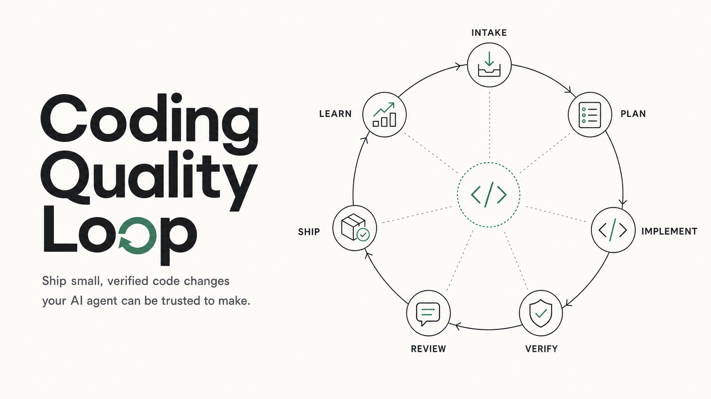
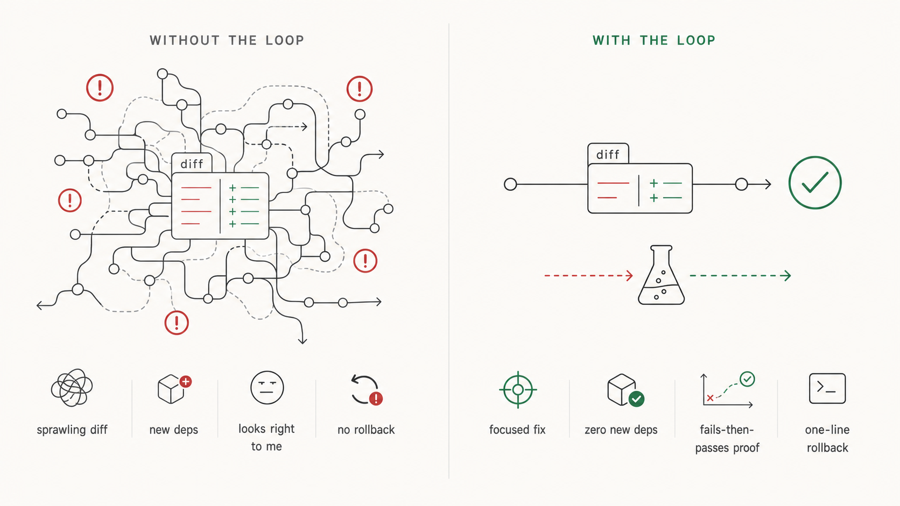
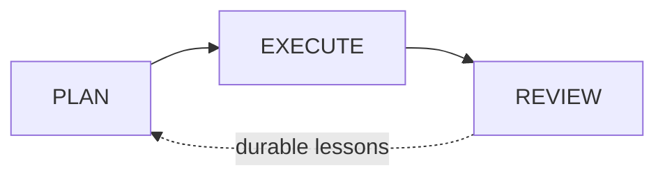
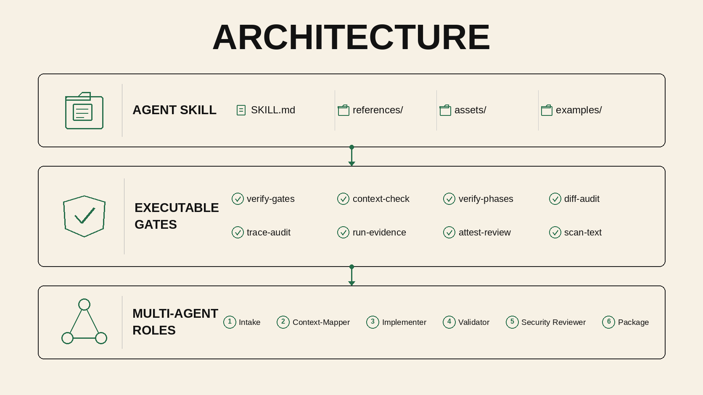
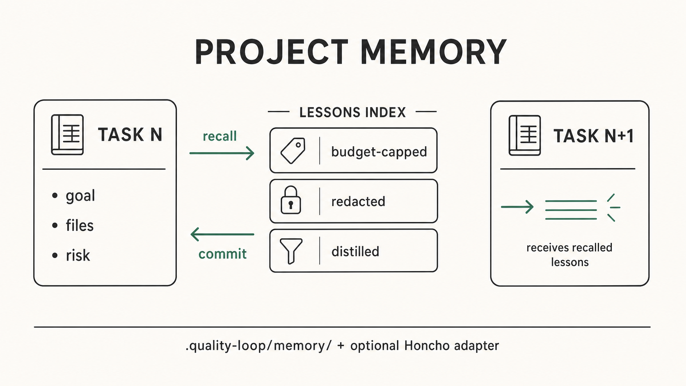
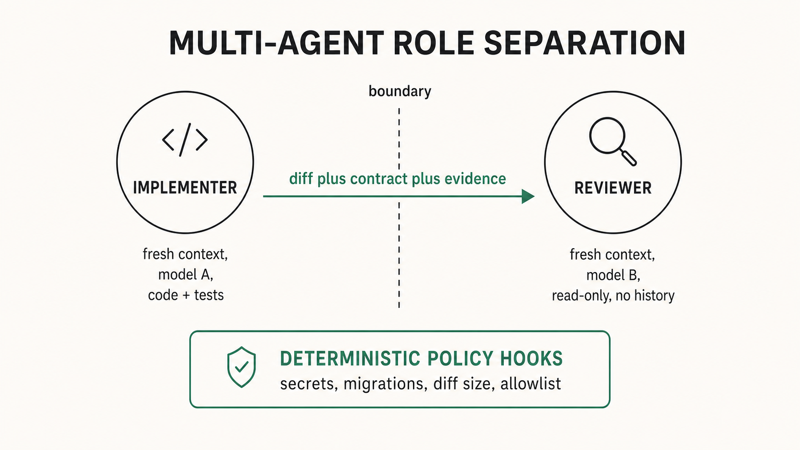

<div align="center">



# Coding Quality Loop

**Make your AI coding agent ship changes you can trust, not giant diffs you have to babysit.**

[](LICENSE)
[](https://www.npmjs.com/package/coding-quality-loop)
[](https://www.npmjs.com/package/coding-quality-loop)
[](https://search.sigstore.dev/?logIndex=2050768324)
[](CHANGELOG.md)
[](https://agentskills.io/specification)
[](https://github.com/zaingz/coding-quality-loop/actions/workflows/evals.yml)
[](evals/)
[](scripts/quality_loop.py)

[](#install--use-matrix)
[](#install--use-matrix)
[](#install--use-matrix)
[](#install--use-matrix)
[](#install--use-matrix)
[](https://www.anthropic.com/engineering/equipping-agents-for-the-real-world-with-agent-skills)

[Quickstart](#quickstart-60-seconds) · [The loop](#the-loop-visualized) · [Install](#install--use-matrix) · [Proof](#proof-you-can-run) · [FAQ](#faq) · [Compare](#how-it-compares) · [Docs](docs/)

<br>



</div>

AI coding agents are fast. Point one at a vague ticket and it can refactor things nobody asked for, pull in a dependency you did not want, claim "tests pass" without showing them, and sign off on its own work. You are left holding a big change you cannot tell is correct.

**Coding Quality Loop makes the agent work like a careful engineer instead.** It pins down what "done" means before writing code, changes as little as possible, proves the change with a test you can see, and has a *separate* agent review the work before it reaches you. What comes back is small, checked, and reversible: something you can read, trust, and merge in minutes.

It is a portable [Agent Skill](https://agentskills.io/specification) for anyone using Claude Code, Codex, Cursor, Pi, or a skills-aware host to write production code. Use it as a copy-paste prompt, a loadable skill, or a multi-agent config. No new tools, no lock-in.

**Contents** · [Why the loop](#why-the-loop) · [Quickstart](#quickstart-60-seconds) · [Loop](#the-loop-visualized) · [Enforcement](#what-it-enforces-and-what-it-does-not) · [Memory](#project-memory) · [Proof](#proof-you-can-run) · [Install](#install--use-matrix) · [Compare](#how-it-compares) · [FAQ](#faq) · [Philosophy](#philosophy)

---

## Why the loop

Same agent, same model. The difference is the process wrapped around it.

You ask your agent to *"fix the checkout retry bug."*

| Without the loop | With the loop |
|---|---|
| A sprawling diff across many files. | A focused fix in one or two files. |
| A new dependency you did not ask for. | No new dependencies. |
| "Looks right to me." | A test that **fails before the fix and passes after**, shown, not claimed. |
| You review it cold, by yourself. | A *second* agent already checked it against the goal. |
| Hope you can undo it. | A one-line rollback, written down. |
| Relearns the same lesson next session. | Remembers it and recalls it next time. |

That is the whole idea: smaller changes, real proof, a second set of eyes, and memory that sticks. The work scales to the risk: a typo just gets fixed; a payment migration runs the full process. See a real worked example in [`examples/walkthrough/`](examples/walkthrough/README.md).

- **New in 3.0.0**: outcome-grounded, model-adaptive, and 40% smaller. The harness now optimizes for code quality (not artifact production), adapts ceremony to model strength via a new **Calibration** principle, and uses a single `verify` command as the primary gate. The **Right-Size Gate** makes "minimal diff is not minimal architecture" part of the rule itself, the reviewer is now a **tool-using evaluator** that executes tests (recording `ran_checks`), and a **communication-bridge** rule prevents review loops. Legacy adapters and local orchestration were archived. See [`CHANGELOG.md`](CHANGELOG.md#300) for the full list of additions.

<details>
<summary><strong>What the agent produces, step by step</strong></summary>

| Step | What the agent produces |
|---|---|
| Task contract | Goal, acceptance criteria, constraints, risk tier. |
| Context map | The 2-3 relevant files, callers, and tests, not the whole tree. |
| Minimality decision | The smallest safe change; bigger rewrites explicitly rejected. |
| Small diff | One focused change, existing conventions, no new deps. |
| Verification evidence | A failing-then-passing test plus typecheck, recorded. |
| Independent review | A separate agent checks the diff against the contract, then approves or blocks. |
| Handoff | A PR summary with evidence, risk note, and rollback. |

The state record in the walkthrough passes the same [`verify-gates`](scripts/quality_loop.py) check the loop enforces.

</details>

---

## Quickstart: 60 seconds

One command. Auto-detects your host (Claude Code, Codex, Cursor, Droid, or Pi), copies the skill, and wires the hooks.

```bash
npx coding-quality-loop init
```

Shipped on [npm](https://www.npmjs.com/package/coding-quality-loop) with signed provenance. Requires Node 18+ and Python 3. Zero runtime dependencies. Interactive by default; add `--yes` for CI, `--dry-run` to preview, `--host <name>` to skip detection. See [`packages/npm/`](packages/npm/) for the full CLI.

```bash
npx coding-quality-loop init --dry-run --yes   # preview only
npx coding-quality-loop add git                # add the pre-commit backstop
npx coding-quality-loop check                  # verify a prior install
```

Prefer manual? Any of the paths below still work — the installer is a thin UX wrapper around [`scripts/install.py`](scripts/install.py), so both paths land the exact same files.

<details>
<summary><strong>A. Drop-in prompt</strong></summary>

```bash
# A — no install: copy the skill into your agent's instructions, then prompt it
#   "Follow the Coding Quality Loop. Ship the smallest correct change with validation evidence."
```

Then ask: *"Use the coding-quality-loop skill to fix the invoice rounding bug and open a PR."*

</details>

<details>
<summary><strong>B. Install as a skill</strong></summary>

```bash
# B — install as a portable skill (Claude Code shown; see the matrix for other hosts)
cp -r . .claude/skills/coding-quality-loop        # project scope
#   ~/.claude/skills/coding-quality-loop           # or user scope
```

Copying the folder into any skills-aware host is the install. There is no build step.

</details>

### 30-second demo

```text
user: Fix checkout retry losing the final error.
agent: Contract: preserve retry count, expose final error, no new deps, medium risk.
agent: Context map: src/checkout/retry.py, tests/test_retry.py, caller api/checkout.py.
agent: Minimality: one localized branch; no retry framework.
agent: Diff: retry.py + regression test.
agent: Evidence: new test fails on base with swallowed error; passes on HEAD; targeted suite green.
reviewer: Fresh-context review approves against the contract; no API or dependency change.
agent: PR: summary, files changed, evidence table, risk note, rollback: revert this diff.
```

---

## The loop, visualized

Three phases, smallest-safe-first, each closed by its own verification gate before the next may start. **Context is a budget; verification is what terminates a phase.** The **right-size gate runs twice**: once in PLAN to choose the smallest approach, once in REVIEW to confirm nothing crept in.

```text
PLAN -> EXECUTE -> REVIEW
```



- **PLAN** — turn the goal into a task contract, map the change, write the validation contract, apply the right-size gate, and produce a plan. Terminates when the plan (and, for non-trivial work, the validation contract) exist and are checkable.
- **EXECUTE** — implement in small slices and verify. Terminates when the smallest sufficient checks pass with recorded evidence.
- **REVIEW** — independent review and ship/handoff. Terminates when a fresh-context reviewer has checked the diff against the validation contract and, for non-trivial work, a completion record exists.

Every older sub-step inherits one of these three phases; nothing is unlabeled. The helper script, config, and state record still use the original nine stable short machine names as sub-steps, so existing records, configs, and automation keep working unchanged:

| Phase | Sub-step (machine name) | What it produces |
|---|---|---|
| PLAN | `INTAKE` | task contract: goal, acceptance criteria, risk tier |
| PLAN | `EXPLORE` | the files that matter, callers, tests — not the whole tree |
| PLAN | `INTAKE`+`PLAN` | `validation-contract.md` — what "done" means before writing code |
| PLAN | `MINIMALITY_GATE` | the smallest valid rung; bigger rewrites rejected with reasons |
| PLAN | `PLAN` | files to change, slices, verification commands, rollback |
| EXECUTE | `IMPLEMENT_SLICE` | one small, reviewable, revertible slice at a time |
| EXECUTE | `VERIFY` | sufficient checks run; exact commands + results recorded |
| REVIEW | `REVIEW` | a separate agent checks the diff against the contract |
| REVIEW | `PACKAGE` | PR handoff + completion record, the shipping gate |
| REVIEW | `RETROSPECT` | repeated mistakes turned into durable harness changes |

The validation contract spans the `INTAKE` and `PLAN` sub-steps, both inside PLAN. Across tasks, durable lessons can persist in optional [per-project memory](#project-memory). See [`SKILL.md`](SKILL.md#lifecycle) for the canonical version of this mapping.

<div align="center">



</div>

See [`docs/architecture.md`](docs/architecture.md) for the three-layer breakdown, and [`docs/quickstart.md`](docs/quickstart.md) for the three adoption paths.

---

## Ceremony scales with risk

A tiny task must **not** be forced through mission ceremony. A medium task must **not** ship without a validation contract and an independent review. ([Task classes](SKILL.md))

<div align="center">


</div>

| Class | Looks like | Process |
|---|---|---|
| **Tiny** | Typo, copy, one-line config, obvious test update. | Inspect, edit, smallest check. No mission artifacts. |
| **Small** | Local bug, one module, low risk. | Quick context map, mini spec, minimal fix, targeted test. |
| **Medium** | Multiple files, a feature, a migration, auth/payment/data risk. | Validation contract, plan, right-size gate, **independent review**, completion record. |
| **Mission** | Multi-day, multi-module, multi-repo, uncertain architecture. | Orchestrator + worker tasks + validators, milestones, shared artifacts. |

---

## What it enforces and what it does not

The differentiator is that the gates are **executable**, not advisory, and the boundaries are explicit. `scripts/quality_loop.py` is a portable, stdlib-only checker. It **complements** CI, tests, scanners, and human review. It does not replace them.

| Enforced today | Not enforced by design, to stay portable |
|---|---|
| Non-trivial work, meaning medium/mission or any medium/high-risk or security-sensitive task, requires a named implementer, a real **validation contract**, an approving **independent review** by someone *other than* the implementer, and, at ship, a **completion record** with evidence. Required fields must be present and non-empty; bare booleans, empty strings, and nonexistent paths are rejected. It checks *shape*, not whether the content is substantive. A small low-risk task ships with handoff evidence, not a formal completion record. | `run-evidence` re-executes allowlisted commands but is **not a sandbox**. The trust model is repo-defined commands, same as CI. Commands not on the `.quality-loop/allowed-commands` allowlist are skipped and reported as `not_allowed`, not run. |
| **Reality layer (v1.5).** `verify-gates --against-diff` reads the real git diff and catches **phantom completion**, **scope integrity**, a **diff-derived risk floor**, **bugfix-test co-presence**, and **stale review hashes**. `run-evidence` **re-executes** recorded pass commands; `--red-green` replays a red_green command in a worktree at base and HEAD. Worktree unavailable means "not proven", never a silent pass. `attest-review` embeds the recomputed diff hash. | Reviewer/implementer separation is compared as trimmed strings and fresh context is self-attested. `attest-review` plus `--against-diff` make review *freshness* checkable, but cannot prove the reviewer *read* the diff. |
| **Detected-risk floor.** The record goal, criteria, and plan are scanned for auth/authz, secrets, crypto, payments, migrations, destructive, concurrency, data-loss, PII, and infra boundaries. Any hit forces high-risk plus security-review gates regardless of the declared tier. | The detected-risk floor is a curated heuristic. It catches honest mis-tiering, not an agent deliberately phrasing around it. **Deterministic policy hooks** remain the backstop for anything you cannot afford an agent to get wrong. |
| **UNDERSTAND is gated.** Non-trivial work must carry a substantive context map with entry points or likely files plus callers or tests. | **`verify-gates` without `--against-diff` reads the record, not the diff.** It confirms recorded evidence is present and well-formed; `--against-diff` adds diff-grounded checks. `diff-audit` and CI remain the blocking layer. |
| Every `pass` command carries a verifiable evidence handle and known `class`; a recorded minimality decision; and `diff-audit` flags secrets, including **untracked files** and **test-weakening**, dependency edits, migrations, and oversized diffs. `diff-audit --staged` covers the pre-commit diff; `scan-text --stdin` is a secret-scan-as-a-service for hook shims. | The helper is not a hosted agent service. Authentication, model cost, and production rollout remain the caller's responsibility. |
| **Repeated failure -> durable change.** A recurring mistake must become a rule/test/hook/checklist/template, so a clean final record cannot bury a mistake corrected only in chat. | Host hooks are advisory unless the host or repo chooses to trust and enable them. Git hooks and CI are the portable backstop. |

The runtime entry points are `verify` (the umbrella: record gates + diff audit + evidence re-execution + AC coverage), `verify-gates`, `verify-gates --against-diff`, `check-record`, `diff-audit`, `run-evidence`, `attest-review`, and `scan-text --stdin`, pinned by [evals](evals/).

**Reviewer heterogeneity.** `check-config` now hard-fails when the implementer and fresh_reviewer resolve to the same model on medium+ tasks. **Tool-using evaluator.** The reviewer must execute tests and benchmarks when available, not just read the diff; the verdict records `ran_checks: true|false`. **Communication-bridge rule.** After the reviewer produces findings, the implementer filters them against the contract: in-scope findings become fix tasks, out-of-scope findings become follow-ups. This prevents review loops.

---

## Project memory

<div align="center">



</div>

Most agents relearn the same lesson every session. The loop can keep a tiny per-project ledger of **distilled lessons**: failure modes, conventions like "no new dependencies here", and gotchas like "this module broke twice". New in v1.4.0.

It is **retrieval, not context stuffing**: only a <=40-line index auto-loads, recall is budget-capped and scoped to the task goal and files, lessons are distilled rather than raw transcripts, **secrets are redacted before they are written**, and writes stay **advisory**. Memory adds no new gate.

```bash
# recall relevant prior lessons before mapping a change
python3 scripts/quality_loop.py memory-recall --goal "fix checkout retry" \
  --files src/payments/charge.py --risk high
# at retrospective, keep a lesson worth remembering
python3 scripts/quality_loop.py memory-commit agent-record.json
```

The default backend is **stdlib-only and checked-in**: `.quality-loop/memory/`, git-diffable and team-shared.

See [`references/memory.md`](references/memory.md) for the memory contract.

---

## Proof you can run

Every claim above is checkable on a clean checkout with no dependencies.

```bash
python3 -m py_compile scripts/*.py evals/*.py                                   # 1. byte-compile
python3 scripts/quality_loop.py check-config assets/quality-loop.config.example.json   # 2. config
python3 scripts/quality_loop.py eval-cases evals/cases --config assets/quality-loop.config.example.json   # 3. static
python3 evals/run_evals.py                                                      # 4. behavioral gates
python3 evals/run_memory_evals.py                                              # 5. memory gates
python3 evals/run_reality_evals.py                                             # 6. reality gates (record↔diff)
python3 evals/run_hook_evals.py                                                # 7. host hook fixtures
python3 evals/run_trigger_evals.py                                             # 8. activation smoke
python3 evals/run_routing_evals.py                                             # 9. model routing
python3 bench/runner.py --mode fixture --seeds 1 --out /tmp/quality-loop-fixture-smoke.json   # 10. bench fixture smoke
```

Current result: **11/11 static** + **32/32 behavioral** + **26/26 memory** + **16/16 reality** + **12/12 routing** + **10/10 trigger** + **9/9 hook** = **116 cases** pass across 7 suites, re-run on every push by a dependency-free [GitHub Actions workflow](.github/workflows/evals.yml).

<details>
<summary><strong>What each proof suite actually proves</strong></summary>

- The **static** suite is an intake-classification regression test. It pins the routing table: risk tier, task class, required gates. It does not prove a gate fires on real prose.
- The **behavioral** suite is where the record gates actually fire. It drives the real CLI against constructed records and asserts hard-to-fake behavior: a self-downgraded boundary task is blocked, placeholder/wrong-content artifacts are rejected, the implementer cannot be the reviewer, and untracked secrets are flagged. One case is a docs-presence lint, not a gate.
- The **memory** suite drives `memory-recall` / `commit` / `prune` against constructed stores and asserts anti-bloat and safety invariants: the index stays <=40 lines even with multi-line lessons, recall respects budget, and secrets are redacted before they land.
- The **reality** suite builds temp git repos where the record and the diff disagree: phantom completion, unmapped file, auth path under low tier, missing bugfix test, stale review hash, lying evidence, red-green catch, staged secret. It asserts the diff-grounded gates catch the lie.
- The **hook** suite feeds fixture JSON into Claude/Codex-compatible shims and checks destructive Bash blocks, secret-write blocks, required edit-before-plan blocks, Stop-gate continuation, SessionStart context, and installer idempotence.

</details>

### Benchmarks, ablation, and live evals

`bench/` contains the proof harness: vendored tasks, trap tasks, objective metrics, and a judge protocol. The committed result [`bench/results/fixture-smoke-2026-07-01.json`](bench/results/fixture-smoke-2026-07-01.json) is a deterministic fixture smoke result. It proves the benchmark plumbing runs; it is not a live Claude/Codex model sweep and should not be quoted as product lift.

**Ablation eval program.** [`bench/ablation-protocol.md`](bench/ablation-protocol.md) defines a 3 tasks × 2-3 model families × 3 seeds × 4 arms (baseline, v3-full, v3-no-review, v3-no-contract) protocol. The headline metric excludes artifact production and measures code-quality lift only. A component whose ablation shows no code-quality lift across >=2 families is a v3.1 cut candidate.

```bash
python3 bench/runner.py --mode fixture --seeds 3
python3 evals/run_trigger_evals.py
```

Live sweeps must record host, model, seed, cost, artifacts, and null results.

For medium/high-risk work, create a state record and run the primary verification command — an umbrella over record-shape gates, diff-grounded reality checks, evidence re-execution, and AC-to-command coverage:

```bash
python3 scripts/quality_loop.py init-record --goal "Fix checkout retry bug" --risk-tier medium --output agent-record.json
python3 scripts/quality_loop.py verify agent-record.json --base origin/main --red-green
```

[`examples/sudoku-agent-eval-2026-06-28/`](examples/sudoku-agent-eval-2026-06-28/README.md) is a committed before/after experiment: four coding agents built the same browser Sudoku app from identical requirements, two with the skill and two without. It is presented honestly as a **single pilot (n=1)**, not a benchmark: the sample is too small to generalize, the rubric is fixed-but-subjective, and the judges are independent but few. The skill variants showed stronger planning, more robust solvers, and better verification evidence; the full numbers, caveats, and the [consolidated report](examples/sudoku-agent-eval-2026-06-28/evaluation-report.md) are committed so you can judge for yourself. Every variant's app source, the skill variants' lifecycle artifacts, and each test suite, rerun with `npm test --prefix <variant>/app`, are in the repo. Headline numbers are intentionally omitted here; use the v2.1 `bench/` harness for repeatable benchmark protocol work instead of quoting this pilot as product lift.

[`examples/sudoku-agent-eval-2026-07-01/`](examples/sudoku-agent-eval-2026-07-01/README.md) is the newer live cross-agent run: Codex, Claude Code, and Droid/GLM-5.2 each built the same Sudoku app with and without CQL. All six arms completed, used zero dependencies, passed `npm test`, and scored `100/100` on the broad machine heuristic. Two blind LLM judges, Claude and Codex, agreed on the ranking; CQL averaged **89.5** vs **85.0** for baselines (**+4.5 points**), with per-agent lifts of Codex **+1.0**, Claude Code **+4.5**, and Droid/GLM-5.2 **+8.0**. Caveat: this was a one-seed live eval and no real browser automation was available, so it is strong directional evidence, not a durable benchmark claim.

---

## Install & use matrix

Pick your host. Full copy-paste files live in [`examples/`](examples/); every path below is real.

| Host | Install | Invoke |
|---|---|---|
| **Any host** (auto-detect) | `npx coding-quality-loop init` | follow the printed "Next steps" for your host |
| **Claude Code** (skill) | `cp -r . .claude/skills/coding-quality-loop` (project) or `~/.claude/skills/coding-quality-loop` (user) | `claude "Use the coding-quality-loop skill to fix the failing test and open a PR."` |
| **Claude Code** (instruction-only) | `cp examples/claude-code/CLAUDE.md ./CLAUDE.md` (or `/init`, then paste the loop) | `claude "Follow the Coding Quality Loop to fix the failing test."` |
| **Codex** | `cp examples/codex/AGENTS.md ./AGENTS.md` | `codex "Follow the Coding Quality Loop in AGENTS.md to fix the bug."` |
| **Cursor** | `cp -r examples/cursor/.cursor ./.cursor` | in chat: `@coding-quality-loop fix the retry bug with verification evidence` |
| **Pi** | `cp -r . ~/.agents/skills/coding-quality-loop` (or in-repo `.agents/skills/`) | `/skill:coding-quality-loop implement the change with a validation contract and independent review` |
| **Droid (Factory)** | `cp examples/droid/.factory/droids/*.md .factory/droids/` (role droids) + skill in repo root | `droid exec "Follow the Coding Quality Loop in SKILL.md to fix the bug and summarize verification evidence."` |
| **Standalone / custom** | route each step from `assets/quality-loop.config.example.json` | follow [`examples/standalone/`](examples/standalone/run-quality-loop.md) |

> **Provenance note:** the `npx` installer ships from the [`coding-quality-loop`](https://www.npmjs.com/package/coding-quality-loop) npm package (source: [`packages/npm/`](packages/npm/)) with signed [Sigstore provenance](https://search.sigstore.dev/?logIndex=2050768324) tying the tarball to a specific GitHub Actions build. It is a thin UX wrapper around [`scripts/install.py`](scripts/install.py), so both paths land the exact same files. This repo is not yet on the [agentskills.io](https://agentskills.io) Skills Hub; `gh skill install` works once a maintainer publishes a release. See [Release & pinning](#release--pinning).

<details>
<summary id="claude-code"><strong>Claude Code install</strong></summary>

Skill mode, progressive disclosure:

```bash
cp -r . .claude/skills/coding-quality-loop
```

Instruction-only mode:

```bash
cp examples/claude-code/CLAUDE.md ./CLAUDE.md
```

Invoke:

```bash
claude "Use the coding-quality-loop skill to fix the failing test and open a PR."
claude "Follow the Coding Quality Loop to fix the failing test."
```

</details>

<details>
<summary id="codex"><strong>Codex install</strong></summary>

```bash
cp examples/codex/AGENTS.md ./AGENTS.md
codex "Follow the Coding Quality Loop in AGENTS.md to fix the bug."
```

</details>

<details>
<summary id="cursor"><strong>Cursor install</strong></summary>

```bash
cp -r examples/cursor/.cursor ./.cursor
```

Invoke in chat:

```text
@coding-quality-loop fix the retry bug with verification evidence
```

</details>

<details>
<summary id="pi"><strong>Pi install</strong></summary>

```bash
cp -r . ~/.agents/skills/coding-quality-loop
```

Or use in-repo `.agents/skills/`. Invoke:

```text
/skill:coding-quality-loop implement the change with a validation contract and independent review
```

</details>

<details>
<summary><strong>Host wiring and hooks</strong></summary>

Install host integrations into a project:

```bash
python3 scripts/install.py --host all
```

This copies the stdlib Quality Loop runtime scripts, host hook shims, `.claude/settings.json`, `.codex/hooks.json`, read-only reviewer agents, pre-commit config, and an example GitHub workflow with backups. Claude Code and Codex hooks remain advisory unless the host trusts/enables them; git hooks and CI are the portable backstop.

Release 1.6 adds first-class host wiring without making any host mandatory:

- `hosts/claude-code/settings.json` wires `SessionStart`, `PreToolUse`, and `Stop` command hooks. Shims are stdlib Python and delegate to the core CLI.
- `.claude/agents/quality-loop-reviewer.md` and `.claude/agents/quality-loop-security-reviewer.md` are read-only reviewer subagents sourced from `references/reviewer-checklists.md`.
- `hosts/codex/hooks.json` uses Codex's current project hook schema. Codex still requires hook trust review in `/hooks`.
- `hosts/git/install-git-hooks.py` and `hosts/git/.pre-commit-config.yaml` provide the universal git backstop: staged `diff-audit` blocks secrets/test weakening.
- `action.yml` and `hosts/github/quality-loop-example.yml` provide CI wiring.
- `scripts/install.py` installs host wiring idempotently and prints what is enforced vs advisory.

**Config-based model routing** — the `model_routing` section in `quality-loop.config.json` maps each model class to a real model per host. `python3 scripts/quality_loop.py setup-models --host <host>` applies it: it rewrites `model:` frontmatter for Claude Code (`.claude/agents/*.md`) and Droid (`.factory/droids/*.md`), or prints the Codex `config.toml` / Pi `/model` settings to apply. `brief` shows the active routing and flags drift. Agent files ship with `model: inherit` so they are host-neutral at rest. Route reasoning effort at **`high`**: `check-config` rejects `xhigh`/`max` unless a model-class block sets `"allow_overthink": true`, because effort is per-step, not per-task endurance — above `high`, models overthink and overspend each step. See the [model capability glossary](references/agentic-orchestration.md#model-capability-glossary) (intelligence / taste / cost, the effort ceiling, and the escalation policy) and [config-driven model setup](references/agentic-orchestration.md#config-driven-model-setup).

A repo can opt into required edit-before-plan blocking with `.quality-loop/config.json`:

```json
{"enforcement": "required"}
```

</details>

### Three adoption levels

- **No install** — paste the [Minimal Drop-In Prompt](SKILL.md) or a host rule file. Zero scripts, zero config. Best for trying it on one task.
- **Install** — copy the skill folder so the agent pulls `references/`, `assets/`, and the state-record schema on demand via progressive disclosure. Best for repeated use.
- **Orchestrated** — adopt `assets/quality-loop.config.example.json` and route each step to a role-based agent profile. Best for multi-agent or production setups.

---

## What's in the box

A single Agent Skill package following the open [Agent Skills specification](https://agentskills.io/specification): `SKILL.md` at the root plus optional sibling folders. **Progressive disclosure** is the core mechanism: the agent always sees the frontmatter `name`/`description`, loads the full `SKILL.md` when relevant, and pulls references/assets/scripts only when a step needs them.

```text
coding-quality-loop/
├── SKILL.md            # the skill: when-to-use, lifecycle, task classes, roles, gates
├── assets/             # templates + schemas loaded on demand (contract, validation contract,
│                       #   plan, logs, completion record, PR summary, progress, record schema,
│                       #   config, per-role prompt cards)
├── references/         # deep-dive docs pulled only when needed (lifecycle, orchestration,
│                       #   reviewer checklists, tool contracts, engineering-OS, philosophy,
│                       #   the memory contract, enforcement matrix)
├── examples/           # host-native copy-paste: claude-code, codex, cursor, pi, droid,
│                       #   standalone, a real before/after walkthrough, + committed Sudoku live evals
├── evals/              # offline eval cases + harness that prove the gates fire
├── scripts/            # quality_loop.py + quality_loop_memory.py — stdlib-only, no third-party deps
└── .quality-loop/      # per-project lessons memory + runs/progress (git-diffable; grows as the agent learns)
```

Minimum tool surface: read, search, edit, shell, run tests, `git diff` / branch / commit / PR. Useful extensions include repo-map generator, AST search, browser automation, GitHub CLI, issue tracker, CI logs, Sentry/Datadog logs, read-only DB access, design docs, and MCP connectors. MCP only when context lives outside the repo, changes frequently, or should be repeatable via a tool. Suggested tool contracts are in `references/tool-contracts.md`.

Medium/high-risk and long-running work maintains a compact state record. Tiny tasks may omit it when the handoff still includes contract, evidence, and risks. Use `assets/agent-record.schema.json` as the canonical schema and the templates in `assets/`: `task-contract-template.md`, `context-map.md`, `validation-contract.md`, `plan.md`, `execution-log.md`, `decision-log.md`, `completion-record.md`, `pr-summary-template.md`, and `AGENTS.template.md`.

### Optional helper commands

Helper script commands are advisory. They do not replace human review, tests, scanners, or CI.

```bash
python3 scripts/quality_loop.py verify agent-record.json --base origin/main --red-green   # primary: record gates + diff audit + evidence + AC coverage
python3 scripts/quality_loop.py init-record --goal "Fix invoice total rounding" --risk-tier medium --output agent-record.json
python3 scripts/quality_loop.py check-record agent-record.json
python3 scripts/quality_loop.py diff-audit --base origin/main
python3 scripts/quality_loop.py diff-audit --staged
python3 scripts/quality_loop.py verify-gates agent-record.json
python3 scripts/quality_loop.py verify-gates agent-record.json --against-diff --base origin/main
python3 scripts/quality_loop.py attest-review review.json --base origin/main
python3 scripts/quality_loop.py run-evidence agent-record.json --red-green --base origin/main
python3 scripts/quality_loop.py scan-text --stdin < suspicious-file.txt
python3 scripts/quality_loop.py brief
python3 scripts/quality_loop.py check-config assets/quality-loop.config.example.json
python3 scripts/quality_loop.py eval-cases evals/cases --config assets/quality-loop.config.example.json
```

`diff-audit` exits non-zero on warnings: possible secrets, dependency edits, migrations, large diffs/file counts. Treat it as a coarse guardrail, not a substitute for gitleaks/trufflehog on high-risk work.

---

## Why agentic-first

<div align="center">



</div>

One model grading its own work is the dominant failure mode. The skill splits the loop into role-based profiles: `orchestrator`, `context_mapper`, `implementer`, `validator`, `simplicity_reviewer`, `security_reviewer`, `policy_guard`. Map each role to the best available model or tool profile. Defaults stay simple: **one implementer + one independent validator + deterministic policy hooks.** Add specialists only when risk justifies the coordination cost; over-parallelization is an anti-pattern. ([Orchestration](references/agentic-orchestration.md))

**Smart Friend pattern (optional).** The implementer can consult a stronger model on defined triggers: 2 failed repair attempts, merge conflicts, or architecture uncertainty. The stronger model gets a fork of the implementer's context and responds with guidance, not code. Per-host wiring: Claude subagent, Droid Task tool, Codex subagent. See [`references/agentic-orchestration.md`](references/agentic-orchestration.md).

---

## How it compares

Other strong skills make different bets, and they are worth your time: [**superpowers**](https://github.com/obra/superpowers) leans into subagent-driven TDD and a two-stage review; [**addyosmani/agent-skills**](https://github.com/addyosmani/agent-skills) ships a broad 24-skill SDLC suite; [**ponytail**](https://github.com/DietrichGebert/ponytail) is a focused minimality ladder.

The Coding Quality Loop's bet is narrower: **executable gates plus candor.** It is one dependency-free package where the non-negotiables are checked by a script you can read and run, and where the README tells you exactly what the script does *not* check. It is positioned against two failure modes, not against other skills: instruction-only prompts that **drift**, and full autonomy that produces **unreviewable diffs**.

For a longer, per-feature comparison (with explicit non-goals and a migration path), see [`docs/comparison.md`](docs/comparison.md).

---

## FAQ

**Does this slow the agent down?** Only where slowness buys trust. Ceremony scales with risk: a typo runs the smallest possible loop with no mission artifacts; the full loop is reserved for work whose blast radius justifies it.

**Does it actually run my tests?** No, and it says so. It checks that the *evidence* of a test run is present and well-formed, not that the run happened. Pair it with CI and real scanners; the loop makes the agent *record* proof, it does not *be* your test runner.

**Is the independent review really independent?** The checker enforces a distinct, named reviewer in fresh context who did not patch the code. Identity is string-compared and freshness is self-attested: strong as a discipline, not a cryptographic guarantee. For production, wire the reviewer to a genuinely separate session or model.

**Do I need the Python helper?** No. The loop works as pure instructions. The helper is an optional, stdlib-only accelerator for teams that want runnable record gates.

**Will it work with my agent?** If it loads `SKILL.md` or accepts a system prompt, yes. Claude Code, Codex, Cursor, Pi, and standalone runtimes are covered with copy-paste files.

**Does it remember across sessions?** Optionally, yes. With [project memory](#project-memory) enabled, distilled lessons persist per-project and are recalled, budget-capped, at the start of the next task, so the agent stops relearning the same thing. It is advisory, stdlib-only by default, and redacts secrets before writing.

---

## Philosophy

> **Bounded autonomy. Smallest correct change. Evidence over confidence. Calibrate to the model.**

Eight defaults the loop encodes, not slogans:

1. **An engineering operating system, not a clever prompt** — durable artifacts that outlive the session.
2. **Bounded autonomy is the product** — the boundary is what makes the output trustable.
3. **Ship the smallest correct change** — deletion, reuse, stdlib, native features before new code.
4. **Evidence over confidence** — every acceptance criterion paired with the check that proves it.
5. **Deterministic gates over vibes** — when a rule matters, a hook or check enforces it.
6. **Repo maps over context stuffing** — a concise map beats reading the whole tree.
7. **Durable harness changes over repeated chat corrections** — a fix becomes a rule, not a re-explanation.
8. **Calibrate ceremony to model strength** — the same scaffolding helps weaker models and can hurt stronger ones. Strong models skip ceremony on tiny/small; weaker models get full scaffolding; review is paid only when the task exceeds what the model does reliably solo. The harness optimizes for code quality (the outcome), not artifact production.

Read the full manifesto: problem framing, trends, honestly-cited inspirations, and explicit non-goals, in [`references/philosophy.md`](references/philosophy.md).

---

## Release & pinning

<details open>
<summary><strong>Treat skills like dependencies</strong></summary>

- **Inspect before you install.** Read `SKILL.md` and `scripts/quality_loop.py` — no hidden
  network access, no build step; the helper is stdlib-only.
- **Pin for team use.** Install from a tagged release or a pinned tree SHA, not a moving branch.
  The packaged version is in `SKILL.md` frontmatter (`metadata.version`) and [`CHANGELOG.md`](CHANGELOG.md).
- **`gh skill` once published.** When a maintainer runs `gh skill publish` (validates against the
  Agent Skills spec and writes repo/ref/tree-SHA provenance into the frontmatter), consumers can
  `gh skill install <repo> --pin <tag|sha>`. Until then, copy-to-folder is the supported install —
  provenance is not hand-faked.
- **Skills Hub publish checklist.** Before publishing to the
  [agentskills.io](https://agentskills.io) Skills Hub:
  1. Bump `packages/npm/package.json` and tag a release (`git tag v3.0.0 && git push --tags`). The [`publish npm`](.github/workflows/publish-npm.yml) workflow will verify the tag matches, run a full `npm pack` + tarball-install smoke, and publish with `--provenance`.
  2. Verify `SKILL.md` frontmatter has `name`, `description`, `license`, `compatibility`,
     and `metadata.version` matching `CHANGELOG.md`.
  3. Run `python3 scripts/quality_loop.py check-config assets/quality-loop.config.example.json`
     and the full eval suite (all 7 suites green: 11 static + 32 behavioral + 26 memory + 16 reality + 12 routing + 10 trigger + 9 hook = 116 cases).
  4. Run `gh skill publish` to validate against the Agent Skills spec and write provenance.
  5. Confirm `gh skill install <repo> --pin <tag>` works on a clean checkout.
- **Enforce the non-negotiables with hooks.** Advisory text drifts; wire the `policy_guard` rules
  (secrets, destructive migrations, auth/billing, diff-size limits) as deterministic host hooks.


<details>
<summary><strong>How this maps to official platform docs</strong></summary>

Portable, but aligned with how today's platforms load instructions and enforce policy:

- **Claude Code memory** — project/user/local `CLAUDE.md`, `.claude/rules/`, `/init`. <https://docs.anthropic.com/en/docs/claude-code/memory>
- **Claude Code hooks** — `PreToolUse` / `PostToolUse` / `Stop` hooks are the deterministic `policy_guard`. <https://docs.anthropic.com/en/docs/claude-code/hooks>
- **Codex `AGENTS.md`** — global, project, and nested overrides. <https://developers.openai.com/codex/guides/agents-md>
- **Codex skills** — `SKILL.md` directories with progressive disclosure. <https://developers.openai.com/codex/skills>
- **Cursor rules** — `.cursor/rules` in `.mdc` format. <https://docs.cursor.com/en/context/rules>
- **Pi skills** — loaded from `~/.agents/skills/`, `.agents/skills/`, etc. <https://pi.dev/docs/latest/skills>
- **Droid (Factory) custom droids** — `.factory/droids/` Markdown files with `model` frontmatter; `droid exec` for headless runs. <https://docs.factory.ai/cli/droid-exec/overview>
- **Anthropic Agent Skills** — `SKILL.md` folders, progressive disclosure. <https://www.anthropic.com/engineering/equipping-agents-for-the-real-world-with-agent-skills>
- **Agent Skills specification** — the open, cross-agent package shape this repo targets. <https://agentskills.io/specification>

The design also draws on Factory Missions (long work split into focused units with fresh agents and
validation contracts), the Aider repo map (concise maps beat context stuffing), the OpenAI
agent improvement loop (the harness is the unit of improvement), Cognition's multi-agent research
(single-threaded writes + clean-context intelligence, April 2026), and Anthropic's long-running
agent harness (progress file + incremental sessions, Nov 2025).

</details>

---

## Community & contributing

- **Docs index** — [`docs/`](docs/) has the quickstart, architecture, comparison, memory guide, and launch kit.
- **Contribute** — [`CONTRIBUTING.md`](CONTRIBUTING.md) explains the PR bar (a task contract, an independent reviewer, and green evals).
- **Roadmap** — [`ROADMAP.md`](ROADMAP.md) lists what is next, ordered by decreasing certainty.
- **Security** — [`SECURITY.md`](SECURITY.md) covers the private disclosure path.
- **Issues & discussions** — file bugs, real-task failure reports, or ideas at [github.com/zaingz/coding-quality-loop/issues](https://github.com/zaingz/coding-quality-loop/issues).
- **Share it** — short-form copy for HN / Reddit / X / LinkedIn lives in [`docs/launch-kit.md`](docs/launch-kit.md).

The best contribution, short of a PR, is using this on a real task and telling us where the docs lied, the gates missed something, or the ceremony felt wrong. Open an issue.

---

## License

MIT — see [LICENSE](LICENSE).

---

## Star history

<div align="center">


</div>
