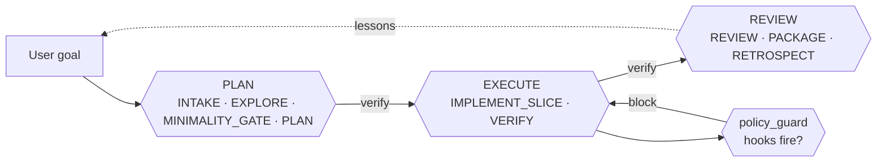
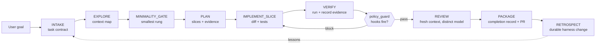

# Architecture

> How the pieces fit together. If the [README](../README.md) is the "what and why", this is
> the "how it is put together on disk".

<div align="center">

</div>

The Coding Quality Loop is deliberately boring under the hood: three layers, no runtime
dependencies, and every non-negotiable enforceable by a single Python script you can read
in one sitting.

## Three layers

### 1. Agent Skill (the package)

The skill is a plain folder that follows the open [Agent Skills specification](https://agentskills.io/specification):
a `SKILL.md` at the root with frontmatter describing when to use it, plus optional sibling
folders that hosts load on demand via **progressive disclosure**.

```text
coding-quality-loop/
├── SKILL.md            # the skill: when-to-use, lifecycle, task classes, roles, gates
├── assets/             # templates + schemas loaded on demand
├── references/         # deep-dive docs pulled only when needed
├── examples/           # host-native copy-paste installs + walkthroughs
├── evals/              # offline eval cases + harness proving the gates fire
├── scripts/            # quality_loop.py — stdlib-only helper CLI
└── .quality-loop/      # per-project lessons memory + run journal
```

Progressive disclosure keeps the always-loaded surface tiny: the agent always sees the
frontmatter, loads the full `SKILL.md` when the task matches, and pulls specific
references, assets, or scripts only when a step needs them.

### 2. Executable gates (the guardrails)

Non-negotiables are enforced by `scripts/quality_loop.py`, a **stdlib-only** Python CLI.
Advisory text drifts across sessions; a gate either fires or it does not.

| Command | What it enforces |
|---|---|
| `verify-gates` | Reads the state record. Confirms every recorded field is present, well-formed, and non-empty. Rejects bare booleans, empty strings, and nonexistent paths. |
| `verify-gates --against-diff` | Adds diff-grounded checks against the real `git diff`: phantom completion, scope integrity, diff-derived risk floor, bugfix-test co-presence, and stale review hashes. |
| `verify` | *(v3)* Umbrella command: runs `verify-gates --against-diff`, `diff-audit`, `run-evidence`, and AC-to-command coverage in one pass. Fails if any constituent section fails; emits a single unified report. Survives a non-git repo (records the diff-dependent sections as failed instead of exiting with no report). |
| `diff-audit` | Scans the diff (or `--staged` for pre-commit) for possible secrets, dependency edits, migrations, oversized changes, and test weakening. Flags untracked files too. |
| `run-evidence` | Re-executes recorded pass commands from the record's allowlist. `--red-green` replays a red_green command in a worktree at base and HEAD. |
| `attest-review` | Embeds a recomputed diff hash so a review verdict cannot silently outlast the diff it approved. |
| `scan-text --stdin` | Secret-scan-as-a-service, for hook shims and paste boxes. |
| `check-record` | Structural lint of a state record against `assets/agent-record.schema.json`. Validates the optional `phase` field against the `plan|execute|review|done|escalated` enum. |
| `check-config` | Structural lint of `quality-loop.config.json` against `assets/quality-loop.config.schema.json`. |
| `eval-cases` | Runs offline eval cases that pin task-class, risk-tier, gate, security-reviewer, completion-record, and right-size-gate logic. |
| `init-record` / `brief` / `setup-models` | Housekeeping and reporting. `init-record` accepts `--phase {plan,execute,review,done,escalated}` to pin the initial phase. |

These commands are **portable and stdlib-only**. They complement CI, tests, scanners, and
human review; they do not replace them. The runtime dependency count is zero.

### 3. Multi-agent roles (the loop)

The canonical model since v2.4 is three phases — **PLAN → EXECUTE → REVIEW** — each closed by its own verification gate before the next may start. The nine sub-steps (`INTAKE`, `EXPLORE`, `MINIMALITY_GATE`, `PLAN`, `IMPLEMENT_SLICE`, `VERIFY`, `REVIEW`, `PACKAGE`, `RETROSPECT`) map onto the three phases and stay valid as machine names in every record and config. Each step can run as a different agent, model, or tool profile, mapped by **role** rather than vendor:

<div align="center">

</div>

| Role | Owns | Default profile |
|---|---|---|
| `orchestrator` | State machine, journal, review isolation | The host CLI (Claude Code, Codex, Droid) |
| `context_mapper` | Task-scoped repo map, entry points, callers | Cheap/fast model (e.g. haiku, GLM cheap) |
| `implementer` | Diff, tests, execution log | Strong code model (sonnet, gpt-5-codex, glm-5.2) |
| `validator` | Independent review against contract + diff + evidence | Strong reasoning model, **different session and identity** |
| `security_reviewer` | Escalated review for auth, payments, migrations, secrets | Strong reasoning model, security-focused prompt |
| `policy_guard` | Deterministic hooks (secrets, protected paths, dependency approval) | Host hooks + git hooks + CI |
| `package` | Completion record, PR handoff, retro | Cheap model — this step is largely mechanical |

Start simple: **one implementer + one independent validator + deterministic policy hooks.**
Add specialists only when risk justifies the coordination cost.

## The state record

Non-trivial work carries a small JSON record that flows through the state machine and
gets checked at each gate. Its shape is pinned by [`assets/agent-record.schema.json`](../assets/agent-record.schema.json):

```jsonc
{
  "goal": "Fix invoice rounding to two decimals for GBP totals",
  "risk_tier": "medium",
  "task_class": "medium",
  "contract": { "acceptance_criteria": [...], "constraints": [...] },
  "context_map": { "entry_points": [...], "callers": [...], "tests": [...] },
  "minimality": { "chosen_rung": "localized fix", "rejected_rungs": [...] },
  "plan": { "slices": [...], "verification": [...], "rollback": "..." },
  "commands_run": [ { "cmd": "npm test -- --run", "class": "pass", "evidence": "..." } ],
  "review": { "reviewer": "validator-b", "verdict": "approved", "diff_hash": "sha256:..." },
  "completion": { "pr_summary_path": "PR.md", "rollback": "revert this diff" }
}
```

The record is not a document written for humans; it is the substrate the gates check
against. Templates for the human-authored parts (task contract, validation contract,
plan, PR summary) live under `assets/`.

## Host integrations

The same package drops cleanly into every major agent host:

| Host | Load surface | Enforced via |
|---|---|---|
| **Claude Code** | `.claude/skills/coding-quality-loop/` or `~/.claude/skills/` | Skill loader + `.claude/settings.json` hooks (`SessionStart`, `PreToolUse`, `Stop`) |
| **Codex** | `AGENTS.md` at repo root + `codex/skills/` | `hooks.json` project-hook schema |
| **Cursor** | `.cursor/rules/*.mdc` | Rule loader |
| **Pi** | `~/.agents/skills/` or in-repo `.agents/skills/` | Skill loader + `/model` per role |
| **Droid (Factory)** | `.factory/droids/*.md` + skill at repo root | Custom droids per role |
| **Standalone** | `assets/quality-loop.config.example.json` | `scripts/quality_loop.py` gates |

Host wiring is idempotently installed by `python3 scripts/install.py --host all`, which
prints exactly what is **enforced** by hooks versus **advisory** in text.

## Data flow

The three phases group the nine sub-steps like this:



Zooming into the sub-steps within each phase:



The **right-size gate runs twice**: once at `MINIMALITY_GATE` to pick the smallest
approach, and again at `PACKAGE` (via `verify-gates --against-diff`) to confirm nothing
crept in. Minimal diff is not minimal architecture: collapsing a multi-feature medium
task into one monolithic file is under-fanned modularity, not minimality.

The `verify` umbrella command closes each phase with the smallest sufficient check:
record-shape gates, diff-grounded reality checks, evidence re-execution, and
AC-to-command coverage. It fails if any constituent section fails and always emits a
single unified report.

## Memory (optional)

If enabled, a tiny per-project ledger of distilled lessons is recalled at `INTAKE` and
committed at `RETROSPECT`. See [`references/memory.md`](../references/memory.md) for the
contract; [`docs/memory.md`](memory.md) for a quick visual overview.

<div align="center">

</div>

## What is portable, what is host-specific

| Portable | Host-specific |
|---|---|
| `SKILL.md`, `references/`, `assets/`, `examples/` | `.claude/settings.json`, `hosts/codex/hooks.json`, `.factory/droids/*.md` |
| `scripts/quality_loop.py` (stdlib only, no host imports) | `scripts/install.py --host <name>` per-host wiring |
| The state-record schema and gate CLI | Native subagent invocations, host-specific model IDs |
| Git hooks (`hosts/git/`) and CI (`action.yml`, via the v3 `verify` umbrella) | Host session lifecycle hooks |

The design goal is that the same skill works everywhere; the gates work the same way
everywhere; and if a host disappears tomorrow, the loop still ships changes.

## Related

- [`SKILL.md`](../SKILL.md) — the full skill, including task classes, role table, and gates
- [`references/lifecycle.md`](../references/lifecycle.md) — step-by-step operating model
- [`references/agentic-orchestration.md`](../references/agentic-orchestration.md) — role → host wiring
- [`references/philosophy.md`](../references/philosophy.md) — why the loop looks like this
- [`docs/comparison.md`](comparison.md) — how it compares to other agent skills
