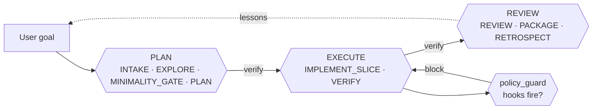
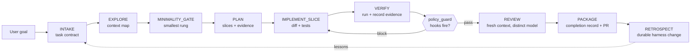

# Architecture

> How the pieces fit together. If the [README](../README.md) is the "what and why", this is
> the "how it is put together on disk".

The Coding Quality Loop is deliberately boring under the hood: three layers, no runtime
dependencies, and every non-negotiable enforceable by a small stdlib-only Python CLI —
six modules under `scripts/`, one of which (`quality_loop_control.py`, the observability
add-on) is opt-in and not installed by default.

## Three layers

### 1. Agent Skill (the package)

The skill is a plain folder that follows the open [Agent Skills specification](https://agentskills.io/specification):
a `SKILL.md` at the root with frontmatter describing when to use it, plus optional sibling
folders that hosts load on demand via **progressive disclosure**.

```text
coding-quality-loop/
├── SKILL.md            # the skill: when-to-use, lifecycle, task classes, roles, gates
├── assets/             # templates + schemas loaded on demand
├── references/         # deep-dive docs pulled only when needed
├── examples/           # host-native copy-paste installs + walkthroughs
├── evals/              # offline eval cases + harness proving the gates fire
├── scripts/            # quality_loop*.py — six stdlib-only modules (control is the opt-in add-on)
└── .quality-loop/      # per-project lessons memory + progress
```

Progressive disclosure keeps the always-loaded surface tiny: the agent always sees the
frontmatter, loads the full `SKILL.md` when the task matches, and pulls specific
references, assets, or scripts only when a step needs them.

### 2. Executable gates (the guardrails)

Non-negotiables are enforced by `scripts/quality_loop.py`, a **stdlib-only** Python CLI.
Advisory text drifts across sessions; a gate either fires or it does not.

| Command | What it enforces |
|---|---|
| `verify-gates` | Reads the state record. Confirms every recorded field is present, well-formed, and non-empty. Rejects bare booleans, empty strings, and nonexistent paths. At medium+ risk, every acceptance criterion must be an object whose `proving_command` matches a pass-labeled recorded command; `blocked` command rows need a non-empty `reason`. Blocking findings print as `error:`, advisories as `note:`. |
| `verify-gates --against-diff` | Adds diff-grounded checks against the real `git diff`: phantom completion, scope integrity, diff-derived risk floor, bugfix-test co-presence, net test-declaration/assertion loss, and stale review hashes. |
| `verify` | Umbrella command: runs `verify-gates --against-diff`, `diff-audit`, `run-evidence`, and AC-to-command coverage in one pass. `--base` defaults to the **merge-base with `origin/main`** (ladder: origin/main → origin/master → main → master), so committed-but-unpushed work stays in the diff; `--timeout <s>` (or `QUALITY_LOOP_TIMEOUT`, default 120) bounds evidence re-execution. Fails if any constituent section fails; emits a single unified report. Survives a non-git repo (records the diff-dependent sections as failed instead of exiting with no report). |
| `diff-audit` | Scans the diff (or `--staged` for pre-commit) for possible secrets, dependency edits, migrations, oversized changes, and test weakening. Flags untracked files too. |
| `run-evidence` | Re-executes recorded pass commands from the record's allowlist. `--red-green` replays a red_green command in a worktree at base and HEAD. |
| `attest-review` | Embeds a recomputed diff hash so a review verdict cannot silently outlast the diff it approved. |
| `render-prompt` | Renders `assets/prompts/reviewer.md` or `security-reviewer.md` with `{contract}`/`{diff}`/`{evidence}` substituted from a record — pipe its stdout to the reviewing CLI. |
| `scan-text --stdin` | Secret-scan-as-a-service, for hook shims and paste boxes. |
| `check-record` | Structural lint of a state record against `assets/agent-record.schema.json`. The record's state machine is the `status` field; a legacy `phase` field is tolerated and ignored. |
| `check-config` | Structural lint of the root `quality-loop.config.json` against `assets/quality-loop.config.schema.json`, including reviewer family heterogeneity. |
| `eval-cases` | Runs offline eval cases that pin task-class, risk-tier, gate, security-reviewer, completion-record, and right-size-gate logic. |
| `memory-recall` / `memory-commit` / `memory-prune` / `memory-status` | Read-only budget-capped lesson recall, distillation with provenance and `--outcome` feedback, and store housekeeping. |
| `init-record` / `brief` / `setup-models` | Housekeeping and reporting. `init-record` scaffolds the record and the run-evidence allowlist. |
| `control-index` / `control-serve` / `control-status` / `control-stop` / `control-ingest` / `control-report` | The opt-in control-plane add-on (`install.py --with-control-plane`). Registered only when `quality_loop_control.py` is present; absent from `--help` otherwise. |

These commands are **portable and stdlib-only**. They complement CI, tests, scanners, and
human review; they do not replace them. The runtime dependency count is zero.

On Claude Code, the **Stop hook runs the `verify` umbrella** (evidence re-execution and
AC coverage included) when the record is at a terminal status (`package`/`done`);
non-terminal dirty-tree stops run `verify-gates --against-diff`. A `protect_harness`
config key (default on) makes edits to the gate scripts, the active record, or the
config tamper-evident at the PreToolUse hook.

### 3. Multi-agent roles (the loop)

The loop narrative groups work into three phases — **PLAN → EXECUTE → REVIEW** — each closed by its own verification gate before the next may start. The phases are presentation; the enforced state machine is the record's `status` field walking the nine sub-steps (`INTAKE`, `EXPLORE`, `MINIMALITY_GATE`, `PLAN`, `IMPLEMENT_SLICE`, `VERIFY`, `REVIEW`, `PACKAGE`, `RETROSPECT`), which stay valid as machine names in every record and config. Each step can run as a different agent, model, or tool profile, mapped by **role** rather than vendor:

<div align="center">

</div>

| Role | Owns | Default profile |
|---|---|---|
| `orchestrator` | State machine, journal, review isolation, every routing decision | The main session (Claude Code) |
| `context_mapper` | Task-scoped repo map, entry points, callers | Fast/cheap capability class |
| `implementer` | Diff, tests, recorded commands | Strong code-specialized class (on Claude Code) |
| `validator` | Independent review against contract + diff + evidence | Strong reasoning class on a **different family** (Codex), separate session |
| `security_reviewer` | Escalated review for auth, payments, migrations, secrets | Strong reasoning model, security-focused prompt |
| `policy_guard` | Deterministic hooks (secrets, protected paths, dependency approval) | Host hooks + git hooks + CI |
| `package` | Completion record, PR handoff, retro | Cheap model — this step is largely mechanical |

Start simple: **one implementer + one independent validator + deterministic policy hooks.**
Add specialists only when risk justifies the coordination cost.

## The state record

Non-trivial work carries a small JSON record that flows through the state machine and
gets checked at each gate. Its shape is pinned by [`assets/agent-record.schema.json`](../assets/agent-record.schema.json):

```jsonc
{
  "goal": "Fix invoice rounding to two decimals for GBP totals",
  "risk_tier": "medium",
  "task_class": "medium",
  "contract": { "acceptance_criteria": [...], "constraints": [...] },
  "context_map": { "entry_points": [...], "callers": [...], "tests": [...] },
  "minimality": { "chosen_rung": "localized fix", "rejected_rungs": [...] },
  "plan": { "slices": [...], "verification": [...], "rollback": "..." },
  "commands_run": [ { "cmd": "npm test -- --run", "class": "pass", "evidence": "..." } ],
  "review": { "reviewer": "validator-b", "verdict": "approve", "ran_checks": true, "diff_hash": "sha256:..." },
  "completion": { "pr_summary_path": "PR.md", "rollback": "revert this diff" }
}
```

The review verdict enum is pinned to `approve | request_changes | needs_discussion |
reject`, and `ran_checks` records whether the reviewer actually executed checks.

The record is not a document written for humans; it is the substrate the gates check
against. The four-artifact paper trail for the human-authored parts — `contract.md`,
`plan.md`, `completion-record.md`, `progress.md` (plus `context-map.md` for EXPLORE) —
lives under `assets/`.

## Host integrations

The same package drops cleanly into every major agent host:

| Host | Load surface | Enforced via |
|---|---|---|
| **Claude Code** | `.claude/skills/coding-quality-loop/` or `~/.claude/skills/` | Skill loader + `.claude/settings.json` hooks (`SessionStart`, `PreToolUse`, `Stop`) |
| **Codex** | `AGENTS.md` at repo root + `codex/skills/` | `hooks.json` project-hook schema |
| **Droid (Factory)** | `.factory/droids/*.md` + skill at repo root | Custom droids per role |
| **Cursor** (advisory rules only, no runtime) | `.cursor/rules/*.mdc` | Rule loader; no hooks |
| **Pi** (advisory rules only, no runtime) | `~/.agents/skills/` or in-repo `.agents/skills/` | Skill loader + `/model` per role; no hooks |
| **Standalone** | `assets/quality-loop.config.example.json` | `scripts/quality_loop.py` gates |

Host wiring is idempotently installed by `python3 scripts/install.py --host all`, which
prints exactly what is **enforced** by hooks versus **advisory** in text, records every
written file in `.quality-loop/install-manifest.json`, and reverses cleanly with
`--uninstall` (npm: `cql remove`). The control plane is installed only with
`--with-control-plane`.

## Data flow

The three phases group the nine sub-steps like this:



Zooming into the sub-steps within each phase:



The **right-size gate runs twice**: once at `MINIMALITY_GATE` to pick the smallest
approach, and again at `PACKAGE` (via `verify-gates --against-diff`) to confirm nothing
crept in. Minimal diff is not minimal architecture: collapsing a multi-feature medium
task into one monolithic file is under-fanned modularity, not minimality.

The `verify` umbrella command closes each phase with the smallest sufficient check:
record-shape gates, diff-grounded reality checks, evidence re-execution, and
AC-to-command coverage. It fails if any constituent section fails and always emits a
single unified report.

## Memory (optional)

If enabled, a tiny per-project ledger of distilled lessons is recalled at `INTAKE` and
committed at `RETROSPECT`. See [`references/memory.md`](../references/memory.md) for the
contract; [`docs/memory.md`](memory.md) for a quick visual overview.

## What is portable, what is host-specific

| Portable | Host-specific |
|---|---|
| `SKILL.md`, `references/`, `assets/`, `examples/` | `.claude/settings.json`, `hosts/codex/hooks.json`, `.factory/droids/*.md` |
| `scripts/quality_loop.py` (stdlib only, no host imports) | `scripts/install.py --host <name>` per-host wiring |
| The state-record schema and gate CLI | Native subagent invocations, host-specific model IDs |
| Git hooks (`hosts/git/`) and CI (`action.yml`, via the `verify` umbrella) | Host session lifecycle hooks |

The design goal is that the same skill works everywhere; the gates work the same way
everywhere; and if a host disappears tomorrow, the loop still ships changes.

## Related

- [`SKILL.md`](../SKILL.md) — the full skill, including task classes, role table, and gates
- [`references/lifecycle.md`](../references/lifecycle.md) — step-by-step operating model
- [`references/agentic-orchestration.md`](../references/agentic-orchestration.md) — role → host wiring
- [`references/philosophy.md`](../references/philosophy.md) — why the loop looks like this
- [`docs/comparison.md`](comparison.md) — how it compares to other agent skills
