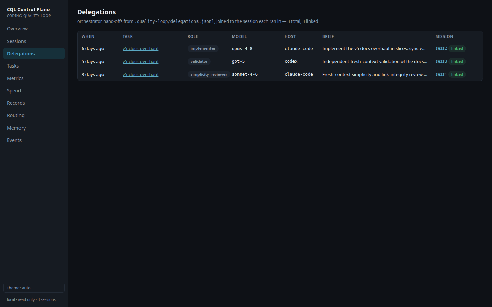
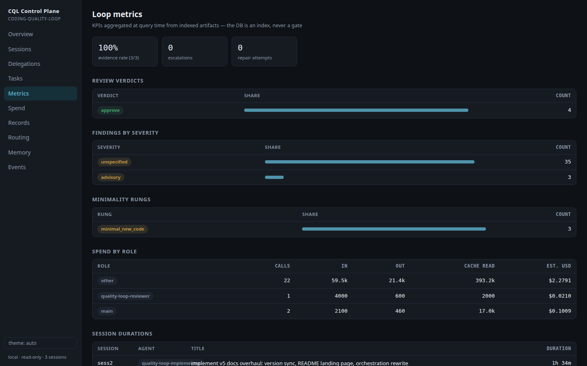

# Control plane — local observability for agent work

One place to monitor, observe, and learn what your agents are doing: every
session, every model call with exact token counts, tool calls, token spend,
routing, hook events, and every Quality Loop artifact (completion records,
independent reviews, individual findings, minimality decisions, plans,
escalations, delegations, memory lessons, progress). Local files in, local
dashboard out — plus a per-task audit report that ties findings, delegations,
verdicts, and spend to the sessions that produced them.

**The control plane is an opt-in add-on, not part of the default install.**
As of v6.0.0 the installer no longer copies it in the default set; nothing
here is required by any gate. Copy `scripts/quality_loop_control.py`,
`hosts/claude-code/control_plane.py`, and `assets/control-plane/` into a
project (or install with the control-plane option) only if you want the
dashboard and audit surface.

```bash
python3 scripts/quality_loop.py control-index    # build/update the index
python3 scripts/quality_loop.py control-serve    # open http://127.0.0.1:4477/
```


## Design rules (why this doesn't violate the repo's own doctrine)

1. **An index over evidence, never a gate.** The SQLite file at
   `.quality-loop/control/control.db` is a disposable cache built from
   sources of truth: host transcripts and CQL artifacts. Deleting the
   directory loses nothing rebuildable — `control-index` regenerates
   everything except recorded hook events, which exist only in the DB.
   A schema bump rebuilds the cache automatically the same way — v6.0.0
   lands at `SCHEMA_VERSION 8` — and because hook events are the one thing a
   rebuild cannot regenerate, a version-mismatch rebuild first exports them
   to `.quality-loop/control/events-backup-schema<N>.jsonl` (`N` = the old
   schema version; append-safe, so repeated rebuilds append rather than
   overwrite). No gate reads any of it.
2. **Local only.** Stdlib `sqlite3` + `http.server`, zero dependencies. The
   server is hard-bound to `127.0.0.1` (not configurable), serves **GET
   only** (anything else is 405), and has no auth because it has no remote
   surface to protect. This is not the "hosted service" the ROADMAP
   excludes — nothing leaves the machine.
3. **Metadata, not conversation bodies.** The index stores model ids, token
   counts, tool names, truncated tool targets (up to 200 chars of e.g. a file
   path, command line, or a sub-agent prompt excerpt — command lines can
   contain whatever you typed into them, secrets included), timestamps, and a
   short session title (the first 160 chars of the first prompt, or the
   host's own summary). Beyond those two deliberate excerpts, conversation
   content is not copied into the DB — and nothing in the index leaves the
   machine either way.
4. **Tokens are facts; dollars are yours.** Spend is reported in exact token
   counts from the host transcript. USD appears only if you fill
   `control_plane.prices` with your own rates — the repo ships no vendor
   price data (decaying vendor data stays documentation-only, per ROADMAP).
   `control-report` is the sanctioned **local audit/report surface**: a
   read-only query over the index (per-task audit bundle; `--arm-costs` for
   bench cost capture), never a gate — no gate reads its output and nothing
   it prints affects the loop. This supersedes the v3.0 "no report
   subcommand" stance for the control plane specifically; the `jq` recipe in
   `assets/routing/README.md` remains for repos that skip the control plane
   entirely.

## What it indexes

| Source | Becomes | Host coverage |
|---|---|---|
| `~/.claude/projects/<repo-slug>*/*.jsonl` (subdirectory slugs included after a per-file cwd check — sessions started from `repo/sub` land under a longer slug) | sessions, model calls (exact `usage` tokens, deduped per API response), tool calls with ok/error status, subagent attribution | Claude Code (transcript adapter) |
| `~/.codex/sessions/*/*/*/rollout-*.jsonl` (scoped per file by `session_meta.cwd`) | sessions (host `codex`), model calls (per-call `last_token_usage` deltas, model from `turn_context`), tool calls, sub-agent lineage | Codex CLI (rollout adapter) |
| `~/.factory/monitoring/droid-wrapper.jsonl` (the `droid-glm-exec` wrapper log; scoped by `cwd`) | sessions (host `droid`) + one `droid_run` **event** and one tool call per exec run — Droid reports no token usage, so no model-call rows are fabricated and call/token totals stay honest | Factory Droid / GLM (wrapper adapter) |
| `.quality-loop/agent-record.json` + `docs/records/*.json` | record / review / **finding** / decision / plan / escalation / models_used artifacts | any host running the loop |
| `.quality-loop/delegations.jsonl` | `delegation` artifacts (one per orchestrator hand-off), joined to their session at query time | any host; written by the orchestrator |
| Hook events via `control-ingest` | session start/end rows, live event feed | claude-code + codex wiring shipped; any host that can pipe JSON |
| `.quality-loop/memory/lessons.jsonl`, `.quality-loop/progress.md` | memory + progress artifacts | any host |

Each review finding (from `review_findings[]` or a review's own `findings[]`)
becomes its own `finding` artifact carrying severity + text + reviewer, so the
finding — the loop's most valuable proof — is queryable, not just counted.

### Delegation ledger

The orchestrator records each worker hand-off by appending one JSON object per
line to `.quality-loop/delegations.jsonl` (an append-only ledger, mirroring the
lessons file). Recognized fields:

```json
{"ts": "2026-07-13T10:00:00Z", "task_id": "T-42", "role": "reviewer",
 "host": "codex", "model": "gpt-5", "brief_summary": "review the slice diff",
 "expected_agent_name": "reviewer",
 "session_id": "3f0c9a2e-4b7d-4c1a-9e6f-8d2b5a1c0e73"}
```

`session_id` — the worker's session id, known at hand-off — is the
producer-side convention (v6): **record it**. A row that carries it joins
directly by id at query time and the heuristic below is skipped entirely; an
explicit id that is not (yet) indexed stays unmatched rather than being
guessed against.

Legacy rows without `session_id` fall back to the fuzzy window match:
`sessions.agent_name` equal to `expected_agent_name`, started within
`[ts-5m, ts+60m]`, nearest wins. The fallback join is **one-to-one** — each
session is claimed by at most one delegation (globally nearest pair first;
the next-nearest goes unmatched instead of double-counting the session's
tokens) — and a row whose `ts` is not parseable ISO-8601 is flagged
`unjoinable` (surfaced per row and as a count on `/api/delegations`), never
silently matched at distance zero. Token totals per delegation are computed
live, never stored as a join. A malformed line is counted (surfaced as
`skipped_lines`) and skipped, never fatal.



Honest labeling: Claude Code and Codex both get deep transcript indexing —
the transcript adapter reads Claude Code's project JSONL files, the rollout
adapter reads Codex's `~/.codex/sessions` rollouts (exact per-call token
deltas, verified to sum to the session totals). Droid is thinner by
necessity: its own session files carry no structured model or token usage,
so the wrapper adapter surfaces each `droid-glm-exec` run as a `droid_run`
event plus a tool call — visible in the UI, but with **no token figures and
no fabricated model-call rows**. The loop's records stay host-neutral either
way: reviews, decisions, and `models_used` attribution show up regardless of
which harness did the work.

Indexing is incremental — the claude and codex adapters share one
incremental reader (per-file byte offset + mtime + head-hash
rewrite-detection) — and deduplicated by message uuid, so a full rescan
never double counts. Unparsable lines are counted and skipped, never fatal:
a future transcript format change degrades to "fewer rows", not a crash.

**Drift canary.** A format change that *renames* usage keys would not skip
lines — it would fill the index with confident zeros. Every indexing pass
therefore counts assistant lines that name a model but carry zero/absent
usage. The cumulative counter is exposed as `zero_usage_lines` on
`/healthz`, `/api/overview`, and `control-status`; `control-index` prints a
warning, and the dashboard shows a banner ("token counts may be stale —
transcript format may have changed") whenever it is nonzero.

## Commands

| Command | What it does |
|---|---|
| `control-index [--all-projects] [--json]` | Incremental index build. `--all-projects` sweeps every project dir under `~/.claude/projects`, not just this repo's. |
| `control-serve [--port N]` | Index, then serve the dashboard + JSON API on `127.0.0.1`. Refuses to double-start (pidfile). |
| `control-status [--json]` | DB path, row counts, server state, enabled flag. |
| `control-stop` | SIGTERM the running server. |
| `control-ingest --event NAME` | Hook entry point: records one event from stdin JSON. No-op unless enabled; **always exits 0**. |
| `control-report --task-id ID [--json]` | Print a per-task audit bundle — goal, status, minimality rung, plan, delegations (with matched sessions), verdicts, findings, escalations, and linked-session spend — as markdown (default) or `--json`. Exits 2 on an unknown task id. |
| `control-report --arm-costs [--since TS]` | Bench cost capture (a query, never a gate): emit per-session `tokens_in`/`tokens_out`/`duration_sec` as JSON, plus totals, shaped for a bench results arm (`bench/runner.py` `COST_FIELDS`; `cost_usd` stays yours to compute). `--since` keeps only sessions active at/after the ISO-8601 cutoff. Until the gate CLI registers the flags, invoke directly: `python3 scripts/quality_loop_control.py control-report --arm-costs --since 2026-07-14T00:00:00Z`. |

### JSON API (all GET, all local)

`/healthz` (includes the `zero_usage_lines` drift-canary counter),
`/api/overview` (ditto), `/api/sessions?limit=`, `/api/session?id=`,
`/api/spend?by=model|day|session|agent`, `/api/records`, `/api/memory`,
`/api/events?limit=`, `/api/routing`, and (v5.1.0, additive)
`/api/delegations` (each row carries `unmatched`/`unjoinable` flags plus an
`unjoinable` count), `/api/task?task_id=` (404 on unknown, 400 without an
id), and `/api/metrics` (loop KPIs; a zeroed 200 on an empty DB). The dashboard at
`/` is a single self-contained HTML file (no external requests, light/dark,
keyboard navigable, with Overview / Sessions / Delegations / Tasks / Metrics /
Spend / Records / Routing / Memory / Events views) — an eval case pins the
self-containment.



**Tool-target redaction.** Tool-call targets (command lines, paths, URLs, and
sub-agent prompt excerpts) can contain a secret you typed at the prompt, so
each is run through the project's memory redactor before it is stored in the
index. A recognized key shape (or a long high-entropy token) becomes
`[REDACTED]`; the redaction happens before truncation so a key straddling the
200-char cutoff is still caught.

## Hooks: opt-in autostart

Nothing is collected until you opt in. In `quality-loop.config.json`:

```json
"control_plane": {
  "enabled": true,
  "autostart": true,
  "port": 4477,
  "retention_days": 90,
  "prices": {}
}
```

With `enabled: true`, the shipped `SessionStart`/`SessionEnd` hooks
(claude-code `settings.json` and codex `hooks.json` both wired by
`install.py`) record session events, and `autostart` launches the dashboard
server in the background on session start — guarded by a pidfile so a live
server is never double-started. With `enabled: false` (the example-config
default) the hooks write nothing and start nothing; explicit
`control-index`/`control-serve` always work regardless.

The ingest path **never fails a session**: every failure exits 0. A broken
or disabled config is a silent no-op (opt-in is checked before anything is
read or written); failures after the enabled check (malformed stdin, a
locked DB) are logged to `.quality-loop/control/ingest-errors.log`. Wall-clock is bounded by the
host's own hook timeout (10s in the shipped wiring; the shim caps its ingest
subprocess at 6s and its git lookup at 5s). A broken observability plane must
degrade to "no data", never to a session that cannot start. (This is the one
place in the repo that deliberately swallows errors; the gates stay loud.)

`prices` maps a model-id substring to your rates in USD per million tokens,
e.g. `{"fable": {"input_per_mtok": 20, "output_per_mtok": 100,
"cache_read_per_mtok": 2}}`. Longest matching substring wins.

`retention_days` (default 90) prunes **every table** at index time —
sessions, model calls, tool calls, artifacts, and events — each by its own
timestamp against one cutoff (rows with no timestamp are kept; they cannot
be dated). Before v6.0.0 only events were pruned; if you relied on the index
as a longer-lived archive, raise `retention_days`. Pruned rows stay pruned:
the per-file offset cache means an unchanged source file is never re-read.

## Privacy and threat model

- Everything stays on the machine: DB, server, dashboard. The bind address
  is hard-coded to loopback, there are no write endpoints, and requests with
  a non-loopback `Host` header are rejected with 403 (DNS-rebinding guard).
- Other processes running as your user can read the DB file and the
  localhost API — same trust boundary as the transcripts themselves, which
  is where the data already lives in plainer form.
- The DB directory self-gitignores (`.quality-loop/control/.gitignore` is
  written with `*` on creation), so control data can never land in a commit
  — and because it lives under `.quality-loop/`, it is excluded from the
  review attestation hash.
- To remove all collected data: `control-stop`, then delete
  `.quality-loop/control/`.

## Eval coverage

The 35-case `evals/run_control_evals.py` suite pins: exact token math,
incremental/rescan dedupe, malformed-line resilience, subagent attribution,
artifact ingestion, price arithmetic, every API endpoint, the 127.0.0.1
bind, GET-only enforcement, dashboard self-containment, ingest no-op when
disabled, exit-0 on garbage, the pidfile double-start guard, real autostart,
config validation, and installer wiring — plus the v5.1.0 audit trail:
first-class findings, delegation ingest (with idempotent re-index and skipped
counting), the delegation→session join, the per-task timeline, loop metrics
(including the empty-DB zero case), the `control-report` CLI, and tool-target
secret redaction — plus the v6.0.0 hardening: the direct `session_id` join,
unjoinable-ts counting (never a distance-0 mismatch), the one-to-one
fallback join, droid runs as `droid_run` events (no fabricated model calls),
the zero-usage drift canary (a renamed-usage-keys fixture must turn it
nonzero), all-table retention pruning, the events backup on a schema bump,
and the `--arm-costs` bench cost query.
