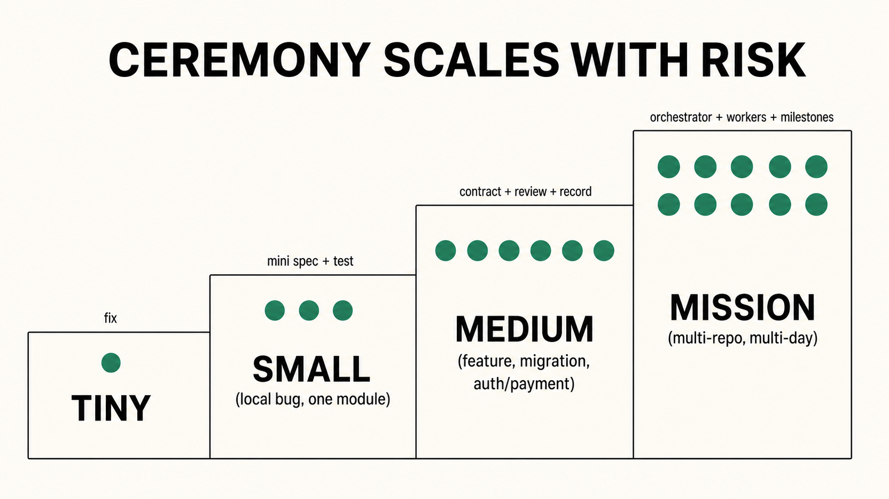

# Quickstart

Three ways to try the Coding Quality Loop, ordered by commitment. Pick the lightest one
that fits your task.

<div align="center">



</div>

## A. No install — drop-in prompt (30 seconds)

Copy this into your agent's system prompt, project instructions, or the top of your
`CLAUDE.md` / `AGENTS.md` / `.cursor/rules`:

```text
Follow the Coding Quality Loop for this task.

1. Write a task contract: goal, acceptance criteria, constraints, risk tier.
2. Map only the files, callers, and tests relevant to the change. Not the whole tree.
3. Pick the smallest safe rung; briefly say what larger rungs you rejected and why.
4. Plan the diff, the verification commands, and the rollback.
5. Implement the smallest reviewable slice. No new dependencies unless the contract asks for it.
6. Verify: run the checks, record the exact commands and outputs. Prefer a failing-then-passing test.
7. Independent review: a distinct reviewer, fresh context, checks the diff against the contract.
8. Ship: PR summary with evidence table, risk note, rollback line.

Ship the smallest correct change with verifiable evidence, not the biggest possible diff.
```

Then prompt: *"Use the Coding Quality Loop to fix the invoice rounding bug and open a PR."*

This works in **every** agent host that accepts a system prompt. No files to copy, no
scripts to run, nothing to install.

## B. Skill install — copy the folder (2 minutes)

Copy the whole repo as a skill folder. Every host that speaks the [Agent Skills spec](https://agentskills.io/specification)
will discover it, keep the frontmatter always-loaded, and lazy-load the rest.

<details open>
<summary><strong>Claude Code</strong></summary>

```bash
# project scope
cp -r . .claude/skills/coding-quality-loop
# or user scope
cp -r . ~/.claude/skills/coding-quality-loop
```

```bash
claude "Use the coding-quality-loop skill to fix the failing test and open a PR."
```
</details>

<details>
<summary><strong>Codex</strong></summary>

```bash
cp examples/codex/AGENTS.md ./AGENTS.md
```

```bash
codex "Follow the Coding Quality Loop in AGENTS.md to fix the bug."
```
</details>

<details>
<summary><strong>Cursor</strong></summary>

```bash
cp -r examples/cursor/.cursor ./.cursor
```

In chat:

```text
@coding-quality-loop fix the retry bug with verification evidence
```
</details>

<details>
<summary><strong>Pi</strong></summary>

```bash
cp -r . ~/.agents/skills/coding-quality-loop
```

```text
/skill:coding-quality-loop implement the change with a validation contract and independent review
```
</details>

<details>
<summary><strong>Droid (Factory)</strong></summary>

```bash
cp examples/droid/.factory/droids/*.md .factory/droids/
```

```bash
droid exec "Follow the Coding Quality Loop in SKILL.md to fix the bug and summarize verification evidence."
```
</details>

## C. Orchestrated — driven mode (5 minutes)

For batch, mission, or CI-driven runs where the orchestrator owns the state machine,
verification, and review isolation:

```bash
# validate your config first
python3 scripts/quality_loop.py check-config assets/quality-loop.config.example.json

# run against a fake host (offline, deterministic — good for CI smoke tests)
python3 scripts/quality_loop_run.py --goal "Fix invoice rounding" --host fake --dry-run

# resume an existing agent record with a human relay
python3 scripts/quality_loop_run.py --record agent-record.json --host manual

# real host adapters
python3 scripts/quality_loop_run.py --goal "Fix invoice rounding" --host claude
python3 scripts/quality_loop_run.py --goal "Fix invoice rounding" --host codex

# medium/mission tasks: enforce the per-phase gates (v2.4)
python3 scripts/quality_loop.py context-check agent-record.json    # per-phase context_budget
python3 scripts/quality_loop.py verify-phases agent-record.json    # current + prior phases passed
python3 scripts/quality_loop.py trace-audit .quality-loop/runs/<id>/execution-log.jsonl
```

The driven runner writes a local redacted journal under `.quality-loop/runs/<id>/`. VERIFY
is orchestrator-native; REVIEW receives only contract + diff + evidence, never the
implementer transcript.

## Full host wiring (optional)

Once you like the loop, install every host integration a repo needs in one command:

```bash
python3 scripts/install.py --host all
```

This copies the stdlib runtime, Claude/Codex host hooks, `.claude/settings.json`,
reviewer subagents, pre-commit config, git hooks, and an example GitHub Actions workflow,
with backups.

Then wire model routing to the models your team actually uses:

```bash
# edit quality-loop.config.json → model_routing block
python3 scripts/quality_loop.py setup-models --host claude-code --dry-run
python3 scripts/quality_loop.py setup-models --host claude-code
```

`setup-models` rewrites `.claude/agents/*.md` and `.factory/droids/*.md` frontmatter,
prints Codex `config.toml` snippets, and prints Pi `/model` commands per role.

## 30-second demo

```text
user: Fix checkout retry losing the final error.
agent: Contract: preserve retry count, expose final error, no new deps, medium risk.
agent: Context map: src/checkout/retry.py, tests/test_retry.py, caller api/checkout.py.
agent: Minimality: one localized branch; no retry framework.
agent: Diff: retry.py + regression test.
agent: Evidence: new test fails on base with swallowed error; passes on HEAD; targeted suite green.
reviewer: Fresh-context review approves against the contract; no API or dependency change.
agent: PR: summary, files changed, evidence table, risk note, rollback: revert this diff.
```

## Which class is my task?

The loop scales ceremony to risk. Match your work to the smallest class that is safe:

| Class | Looks like | Process |
|---|---|---|
| **Tiny** | Typo, copy, one-line config, obvious test update | Inspect, edit, smallest check. No mission artifacts. |
| **Small** | Local bug, one module, low risk | Quick context map, mini spec, minimal fix, targeted test. |
| **Medium** | Multiple files, a feature, a migration, auth/payment/data risk | Validation contract, plan, complexity brake, independent review, completion record. |
| **Mission** | Multi-day, multi-module, multi-repo, uncertain architecture | Orchestrator + workers + validators + milestones + shared artifacts. |

A tiny task must **not** be forced through mission ceremony. A medium task must **not**
ship without a validation contract and an independent review. The detected-risk floor
(`verify-gates`) refuses to let a task self-downgrade around auth, payments, migrations,
crypto, or PII.

## Next

- Read [`docs/architecture.md`](architecture.md) for how the pieces fit.
- Read [`SKILL.md`](../SKILL.md) for the full skill body.
- Read [`docs/comparison.md`](comparison.md) if you want to compare to superpowers,
  addyosmani/agent-skills, or ponytail before adopting.
- Run [Proof you can run](../README.md#proof-you-can-run) on a clean checkout.
