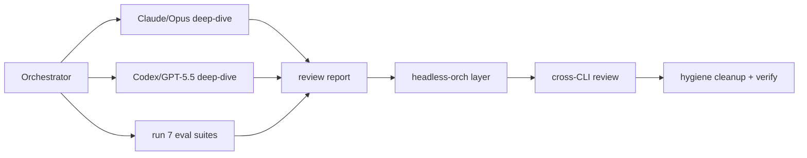

# Spec: Critical review + harness-agnostic headless orchestration layer

Date: 2026-07-09
Status: approved (saved; not yet implemented)
Author: Droid orchestrator

## Context

A critical review of the coding-quality-loop project against the user's guiding
principles, plus a foundational headless orchestration layer that lets any
installed CLI (Claude Code, Codex, Droid, or a custom script) act as the
orchestrator and delegate execution to the others headlessly.

The user's principles:
- Context is the scarce resource.
- Use the right LLM for the right job; everything traceable, reviewable, verifiable.
- Code maintainable, DRY, SOLID.
- YAGNI and the ponytail minimality ladder.

Installed harnesses in this environment: `claude` (2.1.205), `codex` (0.142.2),
`droid`. The system must be flexible enough to adapt to whatever the user has
installed and degrade gracefully when a CLI is missing.

## Current state (from the critical review)

Already strong:
- Context scarcity is the v2.4 guiding principle; progressive disclosure,
  repo-maps-over-context-stuffing, budget-capped memory recall, 172-line SKILL.md.
- Right-LLM routing via `references/agentic-orchestration.md`: per-step routing,
  model capability glossary (intelligence/taste/cost), reasoning-effort ceiling,
  escalation policy, config-driven `setup-models`, reviewer heterogeneity
  hard-failing in `check-config`.
- Traceable/reviewable/verifiable: state records, executable gates (121 eval
  cases across 7 suites), diff-grounded reality checks, review attestation,
  evidence re-execution, helper-integrity hashes.
- YAGNI/ponytail: the Right-Size Gate is YAGNI as an 8-rung ladder; ponytail is
  cited and compared in `docs/comparison.md`.

Gaps found:
1. Anthropic Advisor Strategy (Apr 9, 2026, `advisor_20260301`) is absent. The
   repo's "Smart Friend" is the Cognition variant. Anthropic's version inverts
   the topology: cheap executor drives, smart advisor is consulted not
   commanding. Benchmark: Sonnet+Opus advisor = 74.8% SWE-bench at -11.9% cost;
   Haiku+Opus doubled BrowseComp 19.7 -> 41.2.
2. Opus 4.8 Dynamic Workflows (May 28, 2026) not reflected in Mission Topology,
   which still assumes "serial is the safe default" without addressing when
   host-native parallel orchestration is the right rung.
3. The missing orchestrator-delegates-execution vs executor-consults-advisor
   decision rule.
4. No unified headless orchestration layer; snippets are scattered
   (`bench/live-run-recipe.md`, `examples/droid/`, `packages/npm/src/cli.mjs`).
5. Hygiene: `v240-validation-contract.md` is a stale v2.4 work artifact at the
   repo root; YAGNI/DRY not named explicitly.

## Deliverables

### Deliverable 1: Critical review report -> `docs/critical-review-2026-07-09.md`

Delegated deep-dives (parallel, read-only, fresh context):
- Claude Code/Opus: DRY/SOLID/YAGNI audit of `scripts/quality_loop*.py`
  (3,644 lines across 4 modules), SKILL.md/references coherence, README/docs
  duplication. Structured findings with file:line references and severity.
- Codex/GPT-5.5: adversarial gates/evals review (what still slips past, post
  gate-gaming fix; eval blind spots across 7 suites) and README claims audit
  (any overclaiming vs what `quality_loop.py` actually checks).

Orchestrator verification pass:
- Run the full proof block (7 suites + bench fixture smoke), record actual
  results, verify the "121 cases pass" claim.
- Spot-check traceability claims: helper-integrity hashes print;
  `check-config` reviewer-heterogeneity hard-fail.

Synthesis:
- Principle-by-principle scorecard: context scarcity, right-LLM routing,
  traceability, DRY/SOLID, YAGNI/ponytail.
- Ecosystem gap analysis with citations:
  - Anthropic Advisor Strategy (Apr 9, 2026, `advisor_20260301`).
  - Opus 4.8 Dynamic Workflows (May 28, 2026).
  - Cognition "Multi-Agents: What's Actually Working" (Apr 2026).
- Prioritized v3.2 recommendations (report only, no implementation).
- Reviewer findings attributed per reviewer; disagreements surfaced; filtered
  by the orchestrator per the repo's communication-bridge rule.

### Deliverable 2: Headless orchestration layer (the foundational piece)

New `references/headless-orchestration.md`:
- Orchestrator-in-any-harness: Claude Code, Codex, Droid, or a custom script
  can hold the orchestrator role; the loop's roles stay harness-neutral.
- Headless invocation matrix per role with real commands and safety flags:
  - `claude -p --model opus` (read-only reviewer variants, `--safe-mode`).
  - `codex exec -m gpt-5.5` (sandbox modes `-s workspace-write`).
  - `droid exec`.
  - How each pipes evidence back into the state record.
- The two topologies with a decision rule:
  - Smart-orchestrator-delegates (Missions / Opus 4.8 Dynamic Workflows).
  - Cheap-executor-consults-advisor (Anthropic Advisor Strategy,
    `advisor_20260301`).
  - How the existing Smart Friend pattern maps onto both.
- Adaptation rule: detect installed CLIs (`which claude codex droid ...`) and
  degrade gracefully; cross-CLI review satisfies reviewer heterogeneity by
  construction (different harness = different model + fresh context).

New `examples/orchestrator/README.md`:
- Copy-paste runbook for Droid orchestrating Claude Code + Codex.
- A Claude-as-orchestrator variant.

Small wiring only (right-size rung: minimal new docs, no schema change):
- Pointer lines in `SKILL.md` references list.
- Pointer in `references/agentic-orchestration.md`.
- Pointer in README install matrix.

Execution mechanics:
- Implementation slices delegated to Claude Code/Opus and Codex/GPT-5.5
  headlessly.
- Whichever CLI did not implement a slice reviews it (independent review).
- Orchestrator holds the state record and runs
  `python3 scripts/quality_loop.py verify` against it.

### Deliverable 3: Hygiene cleanup

- `git rm v240-validation-contract.md` (stale v2.4 artifact at repo root).
- Name YAGNI and DRY explicitly in `references/philosophy.md` inspirations.
- One-line YAGNI mention at the Right-Size Gate in `SKILL.md`.

## Final verification + handoff

- Re-run all 7 eval suites + `check-config`; fix any breakage (a docs-presence
  lint case exists).
- Handoff summary with report location, new docs, cleanup diff, and suite
  results.
- Changes left uncommitted unless requested.

## Orchestration diagram

Legend: O = the orchestrator harness (any installed CLI). R1/R2 = delegated
deep-dive reviews run headlessly in fresh context. REP = synthesized critical
review report. D2 = new headless orchestration docs. XR = independent review by
the non-implementing CLI. H = hygiene cleanup and final suite verification.
